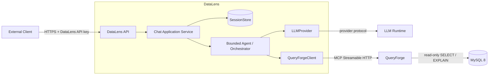
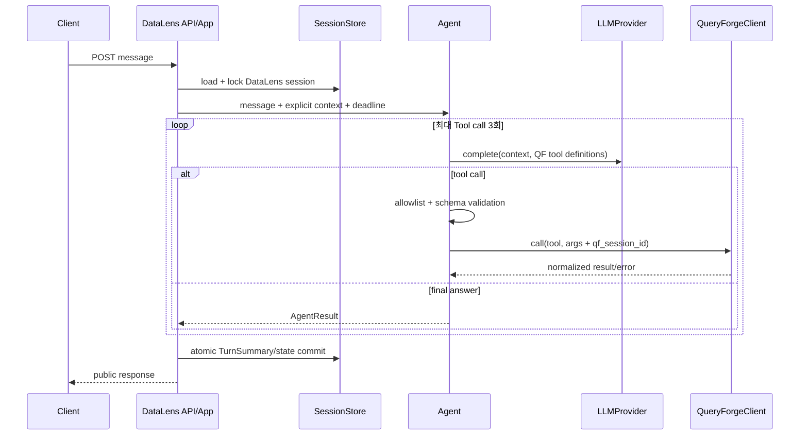

# DataLens Phase 0 — QueryForge 연동 최소 Vertical Slice 설계

| 항목 | 내용 |
|---|---|
| 문서 ID | DATALENS-PHASE0-VERTICAL-SLICE |
| 상태 | Architecture Consistency Gate 통과 구현 기준안 (`ACCEPTED`) |
| 작성일 | 2026-09-08 |
| 적용 범위 | DataLens 첫 HTTP → LLM → QueryForge → MySQL 수직 슬라이스 |
| 선행 문서 | `GLOSSARY.md`, `ADR.md`, `DATALENS-SAD.md`, `SEMANTIC_ARCHITECTURE.md` |
| 외부 계약 근거 | QueryForge `README.md`, `docs/ADR.md`, `docs/QUERYFORGE-DDD1.md`, `docs/QUERYFORGE-DDD2.md`, 실행 가능한 schema/config/source |

> 이 문서는 기존 DataLens Architecture를 대체하지 않는다. 기존 설계에서 첫 구현에 필요한 최소
> 단면을 추출하고, 현재 QueryForge 구현과의 접점을 고정한다. 기존 ADR과 충돌하는 내용은
> 「2.3 충돌 및 선행 결정」에 명시하며 이 문서만으로 ADR을 변경하지 않는다.

---

## 1. 목적

Phase 0의 목적은 다음 경로를 실제로 검증할 수 있는 **가장 작은 정식 구조**를 정의하는 것이다.

```text
HTTP Request
→ DataLens API
→ Application Service
→ Agent / Orchestrator
→ LLM Provider
→ QueryForge MCP Client
→ QueryForge
→ MySQL
→ QueryForge Dataset/Result
→ Agent
→ HTTP Response
```

작게 구현하되 API, 세션, orchestration, provider, MCP client 경계를 분리한다. Phase 0는
throwaway script가 아니며 이후 SAD의 전체 기능을 같은 경계 안에 추가할 수 있어야 한다.

## 2. 기존 Architecture와의 관계

### 2.1 확인한 문서와 적용한 결정

| 문서 | Phase 0에 적용한 핵심 내용 |
|---|---|
| `docs/ADR.md` | QuerySpec 우선, Streamable HTTP, 세션 저장 추상화, 동기 120초, 인증/secret, 3 Tool-step, provider 교체 경계 |
| `docs/GLOSSARY.md` | DataLens/QueryForge 책임과 ID·Dataset 소유권 용어 |
| `docs/DATALENS-SAD.md` | API → Orchestration → Context → LLM/MCP 계층, 명시적 conversation state, 판단/표시 경로 분리 |
| `docs/SEMANTIC_ARCHITECTURE.md` | QueryForge는 의미 판단을 하지 않으며 Semantic truth는 DataLens/Domain Pack에 둔다는 경계 |
| `docs/QUERYFORGE-DDD.md` | 당시 의도한 5개 Tool과 구조화 오류·Dataset 계약 |
| QueryForge `README.md` | 현재 독립 서버, 5개 Tool, `/mcp`, Dataset HTTP API, 인증 방식 |
| QueryForge `scripts/qf.sh` | MCP smoke와 Claude CLI 3턴 acceptance reference |
| QueryForge 실행 가능한 계약 | tool schema, `config/queryforge.yaml`, server/session/data API source. 서술과 충돌 시 이것을 현재 외부 계약으로 판단 |

`SEM-REVIEW-001.md`, `WRENAI_DATALENS_ARCHITECTURE_REVIEW.md`, DB PoC 문서는 전체 제품과 Semantic
설계의 근거로 확인했으나, Phase 0의 transport/API contract를 새로 정의하는 근거로 사용하지 않는다.
백업 디렉터리는 현재 문서보다 권위가 낮아 기준에서 제외한다.

### 2.2 유지되는 기존 설계

- 외부 Client는 DataLens REST API만 호출한다. QueryForge는 외부에 노출하지 않는다.
- Agent는 판단하고 QueryForge는 schema/relationship/query/transform/describe와 실행 안전을 담당한다.
- DataLens는 Dataset 실데이터를 저장하지 않고 참조와 필요한 메타데이터만 유지한다.
- 자연어 대화 연속성은 provider chat history가 아니라 DataLens의 명시적 Session state가 기준이다.
- MCP는 Streamable HTTP이며 공식 SDK를 사용한다. raw JSON-RPC 재구현은 금지한다.
- Phase 0의 요청 처리는 동기식이며 전체 wall-clock 상한은 120초다.
- 전체 행은 LLM 컨텍스트를 통과하지 않는다.

### 2.3 해소한 충돌

| 항목 | 기존 DataLens 문서 | 현재 QueryForge 계약 | Phase 0 처리 |
|---|---|---|---|
| 배포 의존 | 과거 DataLens 문서는 QueryForge wheel 의존을 기재 | QueryForge는 독립 versioned image/MCP 서버 | ADR/SAD를 독립 Streamable HTTP MCP contract 의존으로 정정 |
| Dataset 저장 | 과거 DataLens 문서는 in-memory라고 기재 | Persistent Local DatasetStore (Parquet + SQLite + hot cache) | ADR/SAD/DDD를 현재 계약으로 정정 |
| Preview | 과거 SAD/DDD는 5행 고정으로 기재 | `preview_rows` 요청 가능, MCP byte budget이 최종 제한 | 기본 5행과 요청/serialization 한도를 분리해 정정 |
| QF session | 구 SAD는 DataLens session과 같은 이름으로 release 예시 | QF Application `session_id`는 MCP transport 및 DataLens session과 별도 | 명시적 1:1 mapping을 저장 |
| Health | SAD 초안은 `/v1/health`에서 모든 dependency 표시 | 요청 목적은 liveness/readiness 구분 요구 | `/v1/health`와 `/v1/ready`로 분리 제안 |
| Agent limit | SAD/ADR은 Tool 호출 3회 | qf.sh Claude CLI는 `--max-turns 8` | DataLens가 Tool 호출 3회를 강제. provider turn과 혼동하지 않음 |

위 표의 문서 정합성 수정은 2026-09-08 Consistency Gate에서 완료했다. Phase 0 구현자가 QueryForge를
라이브러리로 포함하거나 Dataset store를 DataLens에 재구현해서는 안 된다.

## 3. Scope / Non-Scope

### 3.1 Scope

- HTTP liveness/readiness와 명시적 session 생성, session-scoped message API
- in-memory `SessionStore`와 TTL
- 하나의 LLM provider 구현
- 공식 SDK 기반 QueryForge Streamable HTTP client
- QueryForge 5개 Tool의 allowlist 및 구조화 결과/오류 처리
- 최대 3 Tool call의 동기 Agent loop
- 자연어 answer, 최소 Dataset reference, warning을 포함한 응답
- 3턴 E2E acceptance와 deterministic test doubles
- DataLens API만 호출하는 `dl.sh agent-check`

### 3.2 Non-Scope

UI, 전체 RCA/Loop Mode, 전체 Semantic bootstrap/RAG, background job, SSE/WebSocket, conversation DB,
multi-instance shared session, 완전한 RBAC, chart renderer, 대규모 observability, 복수 provider 동시 구현,
QueryForge 수정은 포함하지 않는다. Dataset rows proxy는 기존 SAD의 중요한 표시 경로지만 Phase 0
3턴 acceptance에는 필요하지 않으므로 **API extension point만 보존하고 구현은 다음 단계**로 둔다.

## 4. System Context



외부 Client가 알고 있는 식별자는 DataLens `session_id`, `request_id`, 공개된 Dataset reference뿐이다.
LLM provider session, MCP transport session, QueryForge Application session은 내부 식별자다.

## 5. Component Responsibilities

| 컴포넌트 | 책임 | 금지 |
|---|---|---|
| API Layer | 인증, JSON 검증, request ID, HTTP mapping, 요청 deadline 생성 | LLM/MCP 직접 호출, agent loop |
| Chat Application Service | session 생성/조회, per-session 직렬화, orchestration transaction, state commit | provider/MCP wire format 처리 |
| SessionStore | DataLens Session CRUD/TTL, provider/QF mapping, optimistic version | Dataset 행 저장 |
| Agent / Orchestrator | context 조립, 허용 Tool 선택 루프, limit/timeout, 최종 결과 구성 | raw SQL, QueryForge 안전 정책 우회 |
| LLMProvider | provider 요청/응답과 tool-call 표현 정규화, provider timeout/cancel | QueryForge 호출, Application Session 소유 |
| QueryForgeClient | initialize, Tool discovery/call, QF session, 오류 정규화, close/reconnect | 자연어 해석, 결과의 업무 판단 |
| Result Mapper | internal result를 공개 응답으로 축소 | chain-of-thought/provider raw payload 노출 |

권장 핵심 port는 다음 정도면 충분하다.

```text
SessionStore.create/get/update/delete/expire
LLMProvider.complete(messages, tools, deadline) -> AssistantTurn
QueryForgeClient.open/capabilities/call/close
ChatService.create_session/send_message/end_session
```

## 6. External API

### 6.1 경로 결정

기존 SAD의 resource-oriented API를 우선하므로 `POST /api/v1/chat` 단일 편의 endpoint를 채택하지 않는다.
Phase 0 최소 공개 API는 다음과 같다.

| Method | Path | 의미 |
|---|---|---|
| GET | `/v1/health` | process liveness. dependency I/O 없음 |
| GET | `/v1/ready` | LLM과 QueryForge readiness. MySQL은 QueryForge health를 통해 간접 확인 |
| POST | `/v1/sessions` | DataLens Application Session 생성 |
| POST | `/v1/sessions/{session_id}/messages` | 해당 session의 한 대화 턴 동기 처리 |
| DELETE | `/v1/sessions/{session_id}` | session 종료, QF release 시도, 로컬 상태 제거 |

향후 SAD와 동일 경로로 `GET session`, Dataset list/meta/rows를 추가한다. `/api/v1/chat`가 꼭 필요한
Client가 생기면 create-or-send facade로 추가할 수 있으나 canonical contract는 위 resource API다.

모든 보호 endpoint는 `X-API-Key`를 받고, 모든 응답은 `X-Request-Id`도 반환한다. Client가
`X-Request-Id`를 제공하면 유효한 형식일 때 이어받고, 없으면 DataLens가 생성한다.

### 6.2 Session 생성

```http
POST /v1/sessions
X-API-Key: ...
Content-Type: application/json

{}
```

```json
{
  "session_id": "dls_01J...",
  "created_at": "2026-09-08T12:00:00Z",
  "expires_at": "2026-09-08T12:30:00Z"
}
```

성공은 `201 Created`와 `Location: /v1/sessions/{id}`를 반환한다. locale/timezone은 ADR-015에 따라
서버 배포 설정에서 파생하므로 Phase 0 request가 선택하지 않는다.

### 6.3 Message 요청

```http
POST /v1/sessions/dls_01J.../messages
X-API-Key: ...
Content-Type: application/json

{
  "message": "조회 가능한 테이블을 확인해줘. 파티션 테이블이 있으면 하나 짚어줘."
}
```

규칙:

- `message`: 필수 비공백 문자열, UTF-8, 최대 8 KiB.
- body의 `session_id`는 받지 않는다. path와 body의 이중 진실 원천을 피한다.
- 알 수 없는 필드는 `400`으로 거부한다.
- 같은 session의 동시 message는 Phase 0에서 직렬화한다. 대기하지 못한 중복 요청은 `409`다.
- idempotency key는 Phase 0 범위 밖이다. timeout 후 Client는 같은 요청을 자동 재전송하지 않는다.

### 6.4 Message 성공 응답

```json
{
  "request_id": "dlr_01J...",
  "session_id": "dls_01J...",
  "status": "completed",
  "answer": "조회 가능한 테이블은 ...이며, 이 중 ...이 파티션 테이블입니다.",
  "datasets": [],
  "warnings": [],
  "metadata": {
    "turn": 1,
    "duration_ms": 2840,
    "tool_calls": 1,
    "stop_reason": "completed"
  },
  "error": null
}
```

`datasets`는 QueryForge raw response가 아니라 UI-safe reference다.

```json
{
  "dataset_id": "ds_000000123",
  "role": "primary",
  "row_count": 140,
  "columns": [{"name": "EVENT_TIME", "type": "datetime"}],
  "preview": [{"EVENT_TIME": "2024-05-29T11:20:00"}]
}
```

Phase 0에서 `request_id`, `session_id`, `status`, `answer`, `warnings`, `error`는 안정 계약이다.
`datasets`와 `metadata`는 additive extension container이며 field 추가를 허용한다. `steps`, prompt,
provider payload, chain-of-thought는 공개하지 않는다. 운영 진단용 tool name/duration은 내부 로그에 둔다.

### 6.5 비완료 성공 상태

의도가 모호하거나 제한 안에서 안전한 실행 계획을 만들지 못한 경우 HTTP 처리는 성공했으므로 `200`과
`status: "needs_clarification"`을 반환하고 `answer`에 질문을 넣는다. `failed`는 오류 응답에서만 사용한다.
Phase 0는 `queued`, `running`, streaming 상태를 반환하지 않는다.

## 7. Session Model

### 7.1 세 종류의 session

| 종류 | 소유자 | 생성/수명 | 외부 노출 |
|---|---|---|---|
| DataLens Application Session | DataLens | `POST /v1/sessions`; idle TTL 30분; 명시 종료 | `dls_*`로 노출 |
| LLM Provider Session | provider adapter | 필요할 때 생성; adapter 정책에 따라 resume 또는 stateless | 노출 금지 |
| QueryForge Application Session | QueryForge | DataLens가 `/data/sessions` 또는 최초 tool call로 발급; DL session에 mapping | 노출 금지 |
| MCP Transport Session | MCP SDK/QueryForge | initialize 연결 단위; reconnect 시 교체 가능 | 노출 금지 |

### 7.2 DataLens 상태

```text
DataLensSession
├── id / version / created_at / last_active_at / expires_at
├── locale / timezone
├── provider_state_ref?          내부 opaque 값
├── queryforge_session_id?       내부 QF access namespace
├── active_dataset_id?
├── dataset_refs[]               메타만, 기본 최대 20
├── selected_table?
├── history[]                    구조화 TurnSummary, 원문 무제한 누적 금지
└── in_flight_request_id?
```

Phase 0 기본은 in-memory `SessionStore`다. Service는 concrete dictionary가 아니라 interface에만 의존한다.
TTL 만료/DELETE 시 (1) 새 message 차단, (2) QueryForge release best-effort, (3) provider resource cleanup,
(4) local state 제거 순서로 처리한다. QF release 실패는 로그와 metric에 남기되 QueryForge retention 정책이
최종 물리 정리를 담당하므로 DELETE를 무한 실패시키지 않는다.

### 7.3 Mapping과 continuity

- `dls_* → provider_state_ref`와 `dls_* → qf_session_id`는 SessionStore 내부에만 저장한다.
- 후속 턴의 의미 continuity는 `TurnSummary`, selected table, DatasetRef 등 DataLens state로 제공한다.
- provider resume 기능은 최적화일 뿐 진실 원천이 아니다. resume이 유실돼도 구조화 state로 재구성 가능해야 한다.
- QF MCP reconnect 시 transport session만 재initialize하고 동일 `qf_session_id`를 tool argument에 전달한다.
- QF session이 invalid/expired면 기존 Dataset 연속성을 자동 복구했다고 가장하지 않고 session error로 normalize한다.

## 8. LLM Provider Boundary

### 8.1 권장 구현체

Phase 0 첫 정식 provider는 기존 DataLens ADR/SAD 및 QueryForge의 실험 자산과 일치하는
**Ollama HTTP adapter**를 권장한다. 현재 DataLens repository에는 코드·dependency·provider 설정이 없고,
조사 환경에서 Claude CLI executable도 확인되지 않아 Claude CLI를 필수 runtime으로 확정할 근거가 없다.

`LLMProvider`는 다음 정규 형태만 Agent에 제공한다.

```text
complete(
  messages: list[ProviderNeutralMessage],
  tools: list[ToolDefinition],
  deadline: Deadline
) -> AssistantTurn(content?, tool_calls[], usage?, stop_reason)
```

provider model명, endpoint, auth, provider-specific conversation ID, token usage 형식은 adapter 안에 둔다.
Agent가 Ollama/Claude 전용 JSON을 알면 안 된다.

### 8.2 Claude CLI 판단

**결정:** qf.sh와 동일한 Claude CLI 방식은 Phase 0 production 기본 구현체로 사용하지 않는다.

**근거:**

1. `claude -p --allowedTools`는 tool loop와 MCP connection을 CLI 내부가 소유해 DataLens의 명시적
   Orchestrator/QueryForgeClient 경계를 우회한다.
2. `--max-turns 8`은 DataLens의 Tool-call 3회 제한과 의미가 달라 한도를 독립적으로 증명하기 어렵다.
3. provider resume ID에 continuity를 맡기면 SAD의 명시적 Session state 원칙과 충돌한다.
4. CLI 설치·로그인·MCP user-scope 등록은 서비스 컨테이너의 재현 가능한 dependency가 아니다.

**대안:** 빠른 spike가 꼭 필요하면 `ClaudeCliProvider`를 adapter 내부에 격리하고 subprocess timeout,
process group cleanup, `--output-format json`, budget, allowed tool, stderr masking을 강제할 수 있다. 다만 이
모드에서는 CLI가 QueryForge를 직접 호출하므로 정식 architecture E2E acceptance로 판정하지 않고
`qf.sh agent-check`와 같은 수동 비교 시험으로만 취급한다.

### 8.3 현재 Ollama reference 평가

현재 reference는 QueryForge repository의 `scripts/manual_ollama_agent.py`다.

| 항목 | 확인 결과 | Phase 0 판단 |
|---|---|---|
| 기본 모델 | `gemma4:26b` (`OLLAMA_MODEL`로 변경 가능) | 확정 모델이 아니라 실측 후보 |
| 호출 방식 | Ollama `/api/chat`, `tools/list` schema를 function tools로 변환, `tool_calls`를 반복 중계 | provider-neutral Tool-call adapter 설계의 참고 |
| 구조화 출력 | Ollama native tool call은 사용하지만 QuerySpec constrained decoding/로컬 JSON Schema 선검증은 구현하지 않음 | adapter/Agent 구현 전 반드시 보강·검증 |
| MCP 구현 | `requests`로 initialize/JSON-RPC/header를 직접 처리 | 정식 구현에는 재사용하지 않고 공식 MCP SDK로 대체 |
| Session | 첫 Tool 결과의 QF `session_id`를 후속 argument에 전달 | QF Application Session mapping 개념만 재사용 |
| 제한 | 기본 5 step, 호출별 timeout; 전체 DataLens 120초 deadline 없음 | loop 코드는 폐기하고 DataLens Orchestrator가 재구현 |
| Prompt | QueryForge 안전 사용, schema-first, partition scope, error candidate 재시도 지침 | 검토 후 provider-neutral prompt asset으로 분리 가능 |

재사용 가능한 것은 tool schema 변환 방식, QF structured result를 model의 tool message로 되돌리는 형태,
partition/error handling prompt의 **개념**이다. raw MCP 함수, 전역 HTTP session, print 기반 관측, 자유 반복 loop,
script entry point는 production code로 이식하지 않는다. Phase 0 adapter 착수 전에는 후보 Ollama 모델의
native tool-call 정확도, malformed argument 비율, 한국어 3턴 continuity, JSON Schema 강제 가능 여부,
P50/P95 latency와 120초 deadline 내 완주율을 동일 acceptance prompt로 실측해야 한다.

## 9. QueryForge MCP Boundary

### 9.1 연결과 초기화

`QueryForgeClient`는 공식 `mcp` SDK의 Streamable HTTP client를 사용한다.

1. `/mcp`에 API key를 넣어 connect한다.
2. `initialize` 및 `notifications/initialized`를 SDK로 수행한다.
3. `tools/list` 결과가 정확히 허용된 5개 이름을 포함하는지 검증한다.
4. QueryForge Application session을 발급받아 DataLens session에 mapping한다.
5. 모든 `tools/call` argument에 mapping된 QF `session_id`를 전달한다.

허용 Tool은 `schema`, `relationship`, `query`, `transform`, `describe` 다섯 개뿐이다. 서버가 추가 Tool을
광고해도 Phase 0 Agent에는 자동 공개하지 않는다. required Tool 누락이나 input schema 변화는 readiness
실패로 처리한다. Tool schema는 기동 시 cache하되 reconnect 후 capability를 다시 검증한다.

### 9.2 수명

MCP transport session은 client connection pool이 관리하며 DataLens conversation과 1:1일 필요가 없다.
반대로 QF Application session은 Dataset access namespace이므로 DataLens session과 Phase 0에서 1:1이다.
연결 장애 시 안전한 재연결은 허용하지만 결과를 알 수 없는 `query`/`transform` 호출을 Client가 자동
재시도하지 않는다. QueryForge 내부 DB SELECT retry와 DataLens MCP request retry는 별도 계층이다.

### 9.3 Dataset HTTP 경로

Phase 0 Agent는 MCP preview만 사용한다. 향후 Dataset rows API는 DataLens API가 다음 헤더를 내부에서
붙여 proxy한다.

```text
x-api-key: <QueryForge shared secret>
x-session-id: <mapped QueryForge Application session>
```

UI가 QueryForge URL, credential, QF session ID를 직접 얻지 않는다. 공개 `dataset_id`는 opaque reference로
노출할 수 있지만 소유 session과 함께 authorization하고 존재 여부를 감춘다.

## 10. Agent Execution Model

### 10.1 한 턴의 흐름



### 10.2 제한의 소유권

| 제한 | 적용 위치 | Phase 0 값 |
|---|---|---|
| HTTP 전체 wall clock | API/Application deadline | 120초 |
| Tool 호출 수 | Agent/Orchestrator | 최대 3회 |
| 오류 자가 교정 | Agent/Orchestrator | 최대 1회, 총 3회 안에 포함 |
| LLM 호출 timeout | Provider adapter | 남은 전체 deadline 이하 |
| token/output limit | Provider adapter config | 모델별 설정, 전체 budget 안 |
| 금액 budget | 지원 provider adapter | optional; 없으면 token limit로 제한 |
| MCP call timeout | QueryForgeClient | 남은 deadline과 QF 구간 설정 중 작은 값 |
| DB 30초/Transform 10초 | QueryForge | DataLens가 재정의하지 않음 |

deadline은 API 진입 시 monotonic clock으로 한 번 만들고 모든 하위 호출에 **남은 시간**을 전달한다.
개별 timeout을 단순 합산해 120초를 넘기지 않는다. Client disconnect/cancel 시 provider와 MCP 호출을
취소하고 subprocess adapter라면 process group을 정리한다.

### 10.3 Tool 결과 처리

- QF `ok: true` 결과의 preview/metadata만 context에 포함한다.
- query/transform이 만든 DatasetRef는 턴이 성공적으로 끝날 때 Session state에 commit한다.
- byte budget에 의한 preview 축소/truncation은 warning으로 보존한다.
- Tool 결과 안의 text는 **untrusted data block**으로 주입하고 instruction으로 해석하지 않는다.
- limit 도달 시 Dataset 값 없이 답을 꾸며내지 않고 `needs_clarification` 또는 제한 오류로 종료한다.

## 11. Error Model

### 11.1 공개 envelope

```json
{
  "request_id": "dlr_01J...",
  "session_id": "dls_01J...",
  "status": "failed",
  "answer": null,
  "datasets": [],
  "warnings": [],
  "metadata": {"stop_reason": "timeout"},
  "error": {
    "code": "DL_AGENT_TIMEOUT",
    "message": "요청 처리 시간이 초과되었습니다.",
    "retryable": true,
    "details": null
  }
}
```

### 11.2 HTTP mapping

| 분류 | 공개 code 예 | HTTP | 규칙 |
|---|---|---:|---|
| 요청 검증 | `DL_INVALID_REQUEST` | 400 | 잘못된 JSON/field/길이 |
| 인증 | `DL_UNAUTHORIZED` | 401 | key 상세 미노출 |
| session 없음/만료 | `DL_SESSION_NOT_FOUND` | 404 | 타 사용자 session과 동일 응답 |
| session 동시 처리 | `DL_SESSION_BUSY` | 409 | retry 가능 |
| Agent limit | `DL_AGENT_LIMIT_REACHED` | 422 | 안전한 계획 미완성 |
| 전체 timeout | `DL_AGENT_TIMEOUT` | 504 | state는 마지막 완료 턴 유지 |
| LLM provider | `DL_LLM_UNAVAILABLE` | 502/503 | 잘못된 upstream 응답은 502, 연결 불가는 503 |
| QueryForge/MCP | `DL_DATA_SERVICE_ERROR` | 502/503/504 | upstream 성격에 따라 mapping |
| 내부 오류 | `DL_INTERNAL_ERROR` | 500 | correlation ID만 제공 |

QueryForge structured error의 원본 `code`, `retryable`, 안전한 candidate/hint는 **내부 AgentResult와 로그에
보존**한다. 외부에는 allowlist된 의미만 DataLens code/details로 변환한다. 예를 들어
`UNKNOWN_COLUMN`, `MISSING_TIME_RANGE`는 Agent의 1회 교정 입력으로 사용하고, 최종 실패 시 안전한
사용자 설명으로 바꾼다. SQL, stack trace, DB host/credential, provider raw error, QueryForge session ID는
반환하지 않는다.

HTTP status는 transport/application 실패를 표현한다. 안전한 명확화는 오류가 아니므로 `200`,
`needs_clarification`이다.

## 12. Result Model

```text
QueryForge raw result
→ NormalizedToolResult (내부)
→ AgentResult (내부: answer, refs, warnings, stop reason, diagnostics)
→ ChatResponse (공개 allowlist)
```

Phase 0 공개 결과의 중심은 `answer`다. Dataset을 생성한 턴에는 최소 DatasetRef를 포함해 기존 SAD의
향후 UI 표시 경로를 막지 않는다. schema 탐색만 한 턴에는 `datasets: []`가 정상이다.

향후 `datasets[].presentation`에 table/chart spec을, 별도 `evidence`에 공개 가능한 근거를 additive하게
추가할 수 있다. 내부 diagnostics/analysis trace는 공개 evidence와 분리한다. provider reasoning이나
chain-of-thought를 계약으로 만들지 않는다.

## 13. Health / Readiness

### 13.1 `GET /v1/health`

- 인증 없이 process와 event loop가 요청을 처리할 수 있는지만 확인한다.
- LLM, QueryForge, MySQL I/O를 하지 않는다.
- 정상 `200 {"status":"ok"}`. process가 살아 있지 않으면 응답 자체가 없다.

### 13.2 `GET /v1/ready`

- 배포/운영 probe이며 DataLens API key 인증을 요구하거나 내부망에서만 노출한다.
- QueryForge `/health`와 MCP initialize/tool capability를 확인한다.
- LLM endpoint의 경량 model availability를 확인하되 유료 completion을 실행하지 않는다.
- 모든 필수 dependency 정상 시 200, 아니면 503이다.

```json
{
  "status": "ready",
  "checks": {
    "llm": {"status": "ok"},
    "queryforge": {"status": "ok"},
    "database": {"status": "ok"}
  }
}
```

MySQL 상태는 QueryForge `/health`가 제공하는 `database`를 사용한다. DataLens가 DB credential을 보유하거나
DB에 직접 health query를 보내지 않는다. 상세 host/error text는 readiness 응답에 넣지 않는다.

## 14. Configuration

### 14.1 일반 설정

| 키 예 | 기본/제약 |
|---|---|
| `DATALENS_HTTP_HOST`, `DATALENS_HTTP_PORT` | `0.0.0.0`, `8000` |
| `DATALENS_COUNTRY` | 기존 ADR에 따른 locale/timezone 파생 |
| `DATALENS_SESSION_TTL_SECONDS` | `1800` |
| `DATALENS_AGENT_TIMEOUT_SECONDS` | `120`, ADR-012 초과 금지 |
| `DATALENS_AGENT_MAX_TOOL_CALLS` | Phase 0 기본 `3`; config-driven 정책이며 향후 실측으로 조정 가능 |
| `DATALENS_AGENT_MAX_RECOVERY` | `1` |
| `DATALENS_LLM_PROVIDER` | Phase 0 `ollama` |
| `DATALENS_LLM_MODEL`, `DATALENS_LLM_BASE_URL` | 배포별 값 |
| `DATALENS_QUERYFORGE_ENDPOINT` | 내부 `/mcp` URL |
| `DATALENS_QUERYFORGE_DATA_BASE_URL` | QF Application Session release용 내부 Data API origin |

### 14.2 Secret

`DATALENS_API_KEYS`, `DATALENS_QUERYFORGE_API_KEY`, provider credential은 container secret 또는 환경변수로
주입한다. 일반 YAML에는 `*_ref`만 둔다. `.env.example`에는 placeholder만 두며 실제 값, DB credential,
connection string을 commit하지 않는다. DataLens는 DB credential을 아예 받지 않는다.

설정은 typed validation을 거쳐 fail-fast한다. URL scheme, timeout 관계, tool limit, secret 존재 여부를
기동 시 검사한다. environment가 deployment override, config file이 비밀이 아닌 기본값/limit의 기준이다.

## 15. Lifecycle

### 15.1 기동

1. 설정/secret 검증
2. SessionStore와 provider client 초기화
3. QueryForge MCP initialize 및 5개 capability 확인
4. readiness 활성화
5. HTTP traffic 수락

QueryForge/MySQL이 일시 unavailable이면 process는 liveness를 제공할 수 있으나 readiness는 503이다.

### 15.2 종료

1. readiness false 및 신규 요청 차단
2. in-flight request를 drain timeout까지 대기
3. active QF sessions에 release best-effort
4. provider/MCP HTTP client close
5. process 종료

Session TTL reaper는 주기적으로 만료 state를 제거한다. multi-instance 도입 시에는 shared SessionStore와
분산 lock/sticky routing 결정이 선행되어야 한다.

## 16. Security Boundary

- External Client → DataLens만 외부 신뢰 경계다. QueryForge/LLM은 private network에 둔다.
- DataLens API key principal과 session ownership을 결합해 다른 principal의 session 존재를 숨긴다.
- QF shared secret과 QF session ID는 로그/응답에서 마스킹한다.
- Tool name allowlist와 server-advertised JSON schema 양쪽을 호출 전에 검증한다.
- LLM은 raw SQL 또는 임의 code를 실행할 권한이 없다. QueryForge QuerySpec 경로만 사용한다.
- Dataset preview는 untrusted DB data이며 prompt instruction과 구획한다.
- request log는 ID, latency, count, error code를 기록하되 row value와 발화 원문은 기본 로그에서 제외한다.
- 모든 outbound URL은 설정된 LLM/QF origin만 허용한다. 사용자 입력으로 URL을 만들지 않는다.

## 17. `dl.sh` / Operations

Phase 0 필수 command는 다음으로 제한한다.

| command | 동작 |
|---|---|
| `up` | `.env`를 사용해 local DataLens process 시작 |
| `down` | helper가 시작한 process를 정상 종료; 외부 service/data 삭제 없음 |
| `restart` | local process 재시작 |
| `rebuild` | `.venv` editable package 재설치 후 재시작 |
| `status` | PID 기반 local process 상태 |
| `logs` | `.datalens/server.log` follow |
| `health` | DataLens `/v1/health`, 이어서 `/v1/ready` 확인 |
| `smoke` | DataLens session 생성 후 즉시 DELETE하는 dependency-free API contract 검사 |
| `agent-check` | 아래 3턴을 **DataLens HTTP API만으로** 실행 |

`refresh`, `key`, `register`는 QueryForge 운영 책임이므로 DataLens helper에 복제하지 않는다.
`agent-check`는 QueryForge URL/key를 읽거나 `/mcp`, `/data/*`를 호출하면 실패하도록 작성한다.

```text
POST /v1/sessions → dls session 획득
POST /v1/sessions/{dls}/messages (Turn 1)
POST /v1/sessions/{dls}/messages (Turn 2)
POST /v1/sessions/{dls}/messages (Turn 3)
DELETE /v1/sessions/{dls} (finally cleanup)
```

응답마다 동일 DataLens `session_id`, expected status, non-empty answer를 검사하고 Turn 2에는 DatasetRef가
생성되었는지 확인한다. script는 내부 provider/QF ID를 파싱하지 않는다.

## 18. Test Strategy

### 18.1 Unit (항상 deterministic, network/비용 없음)

- Session 생성/TTL/ownership/동시 요청/atomic commit
- API schema와 HTTP/error mapping
- provider-neutral response와 tool call parsing
- QueryForge structured success/error normalization
- allowlist, schema validation, Tool-call/recovery/deadline limit
- public Result Mapper의 민감 필드 제거

### 18.2 Contract / Integration

- fake LLM + fake MCP server로 HTTP 전체 orchestration 검증
- 실제 QueryForge `/mcp` initialize, notification, tools/list, schema(list_tables)
- 실제 Ollama에서 tool call 형식과 final response 검증(명시적 marker, 일반 CI 제외 가능)
- QF reconnect 시 transport session 교체와 Application session 유지 검증
- QF Dataset session isolation 및 release 검증

### 18.3 E2E

실제 LLM + QueryForge + read-only MySQL을 사용하는 `dl.sh agent-check`를 manual acceptance로 둔다.
외부 비용/비결정성이 있는 provider 시험은 `live` marker와 명시적 opt-in 환경변수를 요구하고 일반 CI에서
실행하지 않는다. CI gate는 fake provider로 같은 3턴 state transition과 error path를 재현한다.

## 19. Phase 0 Acceptance Criteria

| ID | 기준 |
|---|---|
| P0-AC-01 | External Client는 DataLens HTTP 외 endpoint/credential 없이 3턴을 완주한다 |
| P0-AC-02 | Turn 1이 QF `schema(list_tables)`를 실제 호출하고 파티션 테이블을 하나 식별한다 |
| P0-AC-03 | Turn 2가 동일 `dls_*`로 이어지고 QF `query` 결과 DatasetRef와 실제 데이터 요약을 반환한다 |
| P0-AC-04 | Turn 3이 이전 결과를 문맥으로 사용해 추가 rows 조회 필요 여부를 답한다; 필요 시 QF capability만 사용한다 |
| P0-AC-05 | 세 응답의 공개 session ID는 동일하고 provider/QF/MCP session ID는 노출되지 않는다 |
| P0-AC-06 | 한 요청의 Tool call은 3회, recovery는 1회, wall clock은 120초를 넘지 않는다 |
| P0-AC-07 | Agent에 공개되는 Tool은 QueryForge 5개뿐이며 raw SQL/code 실행 경로가 없다 |
| P0-AC-08 | QF structured error가 DataLens error로 normalize되고 secret/SQL/stack이 응답에 없다 |
| P0-AC-09 | `/v1/health`는 dependency 장애 중에도 liveness를, `/v1/ready`는 503을 정확히 반환한다 |
| P0-AC-10 | DELETE/TTL이 QF release를 시도하고 이후 message가 404다 |
| P0-AC-11 | deterministic CI test는 LLM 비용이나 MySQL 없이 전체 API state flow를 검증한다 |
| P0-AC-12 | live acceptance 로그로 HTTP→LLM→MCP→MySQL→응답 각 hop의 request ID/latency를 확인할 수 있다 |

Turn 3의 “Dataset rows API가 필요한지” 판단은 Dataset 크기, preview truncation/warning, 질문의 요구 범위를
근거로 해야 한다. Phase 0 Agent가 rows API를 직접 읽는 기능은 필수가 아니다. 필요하다고 판단하면 향후
표시 경로가 필요하다고 답하며, 데이터를 추측해 보완하지 않는다.

## 20. Future Extension Points

- `SessionStore`: SQLite → shared store, multi-instance locking
- `LLMProvider`: Claude/OpenAI/other provider adapters
- `QueryForgeClient`: connection pool/HA와 capability version negotiation
- API: Dataset list/meta/rows proxy, SSE/job polling, idempotency key
- Result: table/chart presentation, curated evidence, citations
- Agent: SAD의 단계별 state machine, deterministic reference resolver, SemanticProvider
- Security: principal별 datasource/table policy와 RBAC
- Operations: metrics/tracing 및 golden-set evaluation harness

extension은 기존 port의 새 구현 또는 response의 additive field로 넣는다. Phase 0 공개 field의 의미를
provider-specific 개념으로 바꾸지 않는다.

## 21. Implementation Sequence

아래 파일명은 다음 구현 작업의 권장안이며 실제 framework 선택 시 이름은 조정할 수 있다.

### I1. Project skeleton, config, liveness

**목적:** 실행 가능한 DataLens process와 typed config를 만든다.

**예상 변경:** `pyproject.toml`, `src/datalens/main.py`, `src/datalens/config.py`,
`src/datalens/api/health.py`, `.env.example`, `tests/unit/test_config.py`, `tests/api/test_health.py`.

**완료 조건:** `/v1/health` 200, invalid/missing secret fail-fast, production dependency는 lock 가능.

**테스트:** config unit, ASGI liveness test.

### I2. Application Session과 외부 API

**목적:** LLM/QF 없이 session lifecycle과 message contract를 고정한다.

**예상 변경:** `domain/session.py`, `ports/session_store.py`, `adapters/memory_session_store.py`,
`application/chat_service.py`, `api/sessions.py`, `api/errors.py` 및 tests.

**완료 조건:** create/message/delete, TTL, principal isolation, per-session concurrency, response envelope.

**테스트:** unit + API contract tests; fake orchestrator 사용.

### I3. QueryForge MCP client

**목적:** 공식 SDK로 현재 QueryForge 계약을 캡슐화한다.

**예상 변경:** `ports/queryforge.py`, `adapters/queryforge_mcp.py`, `application/qf_errors.py`, contract tests.

**완료 조건:** initialize/tools/list/schema, 5-tool allowlist, QF session mapping, reconnect/release, normalized error.

**테스트:** fake MCP unit + 실제 QueryForge contract integration.

### I4. LLM Provider adapter

**목적:** provider-neutral Tool-call interface와 첫 Ollama 구현을 만든다.

**예상 변경:** `ports/llm.py`, `adapters/ollama.py`, `domain/messages.py`, provider tests.

**완료 조건:** content/tool-call/usage/stop reason parsing, timeout/cancel, malformed response fail-closed.

**테스트:** mocked HTTP unit; opt-in live model integration.

### I5. Bounded Agent / Orchestrator

**목적:** provider와 QF client를 결합하되 제한을 중앙 강제한다.

**예상 변경:** `application/agent.py`, `application/deadline.py`, `application/context.py`, prompts, tests.

**완료 조건:** Tool 3회, recovery 1회, QF-only allowlist, 120초 deadline, structured state update.

**테스트:** scripted fake provider/QF로 success, clarify, limit, timeout, injection/error cases.

### I6. HTTP E2E vertical slice

**목적:** real application wiring과 readiness를 완성한다.

**예상 변경:** composition root, `api/readiness.py`, integration fixtures, compose configuration.

**완료 조건:** HTTP→fake/real LLM→real QF→MySQL→HTTP 단일턴 및 동일 session 후속턴.

**테스트:** deterministic integration + opt-in live E2E.

### I7. `dl.sh`와 3턴 acceptance

**목적:** 사용자 관점의 재현 가능한 운영/검증 entry point를 만든다.

**예상 변경:** `dl.sh`, `docker-compose.yml`, `tests/acceptance/` 또는 script fixture, 운영 문서.

**완료 조건:** 필수 command 동작, `agent-check`가 오직 DataLens API를 호출해 P0-AC-01~05를 검증.

**테스트:** shell syntax/static test, compose smoke, live manual acceptance.

### I8. Hardening

**목적:** 장애·cleanup·민감정보·관측 경계를 검증한다.

**예상 변경:** redaction/logging, graceful shutdown, TTL reaper, failure injection tests.

**완료 조건:** P0-AC 전체 통과, secret/SQL/stack 비노출, cancel/reconnect/release 증명, 문서와 설정 일치.

**테스트:** timeout/cancel, malformed upstream, dependency outage, session isolation, log redaction.

## 22. 주요 판단 요약

| # | Decision | Rationale | Alternative | Why not |
|---|---|---|---|---|
| 1 | 첫 provider는 Ollama HTTP | 기존 ADR/SAD 방향과 manual asset, 서비스형 adapter 경계 | Claude CLI | 현재 미설치이며 orchestration/MCP 경계를 CLI가 소유 |
| 2 | Claude CLI는 optional spike adapter만 | qf.sh 실사용 reference 가치는 보존 | production 기본 | 재현성·session·limit 통제 불충분 |
| 3 | 외부 session은 DataLens ID | provider 교체와 QF lifecycle 독립 | Claude/QF ID 노출 | 외부 계약 결합과 보안 누출 |
| 4 | DL session과 QF Application session 1:1 mapping | Dataset namespace 격리와 cleanup 단순 | MCP transport ID 사용 | reconnect 시 바뀌며 소유권 ID가 아님 |
| 5 | API 진입점이 120초 deadline 소유 | 모든 하위 작업을 하나의 wall clock으로 제한 | 계층별 timeout만 | 합계 초과와 orphan work 가능 |
| 6 | Tool/recovery limit는 Orchestrator 소유 | provider와 무관하게 검증 가능 | provider max-turn만 | Tool call과 provider turn은 다른 개념 |
| 7 | QF error는 내부 보존, 외부 allowlist mapping | Agent 교정성과 보안 동시 확보 | raw passthrough | SQL/내부정보 및 unstable contract 노출 |
| 8 | Dataset ID는 생성된 경우 opaque ref로 노출 | 기존 SAD UI rows 경로와 연속성 | 전부 숨김/전체 raw 노출 | UI 확장 차단 / 내부 과다 노출 |
| 9 | 안정 envelope + additive containers | UI 계약을 깨지 않고 확장 | provider raw response | provider 종속 |
| 10 | `dl.sh agent-check`는 DataLens API만 호출 | 전체 경로의 acceptance를 증명 | qf.sh 복제 | DataLens를 우회해 목표 미검증 |

## 23. 구현 전 남은 확인 Gate

문서상 wheel 의존, in-memory Dataset, 고정 preview 충돌은 2026-09-08 Consistency Gate에서 해소했다.
코딩 시작 전 남은 Gate는 provider 실측이다.

1. provider 실측 spike에서 Ollama model의 tool-call 유효율·latency가 Phase 0 기준을 충족하는지. 실패 시
   `LLMProvider` 경계를 유지한 채 다른 API provider를 선택하며 Claude CLI를 곧바로 production 계약으로
   승격하지 않는다.

이 Gate는 본 문서의 architecture 경계를 바꾸지 않는다. 구현체 및 기존 문서 정합성만 확정한다.

### 23.1 2026-09-08 Feasibility 실행 결과

정적 QuerySpec validation은 대표 9개 케이스를 모두 통과했다. 다만 조사 환경에 Ollama executable/API와
`gemma4:26b`가 없어 native tool calling, 한국어 multi-turn, constrained decoding 결합, latency는
`BLOCKED_BY_ENVIRONMENT`다. 상세 결과는 `DATALENS-PHASE0-OLLAMA-FEASIBILITY.md`를 참조한다.

I1 Project skeleton/config/health, I2 Session/API, I3 QueryForge MCP Client는 provider와 독립적으로 진행할
수 있다. I4 Ollama adapter와 I5 Agent를 완료 판정하기 전에는 동일 spike를 실제 배포 후보 모델로 재실행해야
한다. Architecture 변경은 필요하지 않다.

## 24. Implementation Status

2026-09-08 Step 3 Foundation에서 I1~I3를 구현했다.

| 단계 | 상태 | 검증 |
|---|---|---|
| I1 Project skeleton/config/health | 완료 | typed config, fail-fast secret/limit 검증, liveness/readiness, request ID, JSON logging |
| I2 Session/API | 완료 | in-memory TTL store, opaque DataLens Session, create/message/delete, 동시 turn 거부, Agent 미구현 시 명시적 503 |
| I3 QueryForge MCP Client | 완료 | official MCP SDK, v1 allowlist, normalized schema/result/error, QF session 전달, caller deadline, cleanup/readiness |
| I4 OllamaProvider | 구현 완료, live 미검증 | provider-neutral message/Tool-call contract, `/api/chat` adapter, caller deadline, timeout/error normalization, cleanup |
| I5 Bounded Agent | 구현 완료, live 미검증 | local Tool schema validation, Tool 3회/recovery 1회, bounded context, QF session continuity, commit-on-success |
| I6 HTTP Vertical Slice | 구현 완료, live 미검증 | message API → ChatApplicationService → Agent 연결, public result/error mapping, turn lock와 lifecycle |
| 실제 QueryForge integration | 환경 차단 | 실행 중인 endpoint와 credential이 없어 integration test 1건 명시적 skip |

### 24.1 Step 5 Operations / Hardening 결과

**Feature Implementation: COMPLETE**  
**Deployment Packaging: COMPLETE**  
**Live Verification: PENDING**

| 단계 | 상태 | 검증 |
|---|---|---|
| I7 `dl.sh` | 구현 완료, live 미실행 | local process lifecycle, authenticated health/readiness, dependency-free smoke, DataLens API-only 3-turn `agent-check`, shell/static test |
| I8 lifecycle/hardening | 구현 완료, live 미검증 | QF release best-effort, deterministic TTL reaper, dual readiness, capability cache, error 분류, redaction/leak tests, isolated shutdown |
| I9 deployment packaging | 완료, server 배포 미실행 | versioned non-root image, DataLens-only Compose, secret-safe context, container-aware `dl.sh`, preflight, shutdown live-session cleanup |

QF Application Session cleanup은 실제 QueryForge 계약인
`POST /data/sessions/{session_id}/release`를 전용 port operation으로 캡슐화한다. 404는 이미 release된 것으로
간주하며, release 실패는 안전한 구조화 event만 기록하고 local cleanup을 막지 않는다. Store는 network를
알지 못하며 만료 후보만 반환한다.

Ollama native tool-result message는 repository reference에 따라 `role=tool`과 `content`를 사용한다. Tool
identity는 직전 assistant message의 `tool_calls[].function.name`에 보존됨을 mock payload test로 고정했다.
`/v1/ready`는 인증 후 QueryForge와 Ollama `/api/tags` model inventory를 함께 검사하며 endpoint, credential,
raw error를 공개하지 않는다.

공식 MCP SDK의 현재 `BaseSession`은 request ID별 response stream으로 응답을 multiplexing한다. 이를 근거로
Tool call 전역 lock은 제거했고 initial/explicit-refresh capability discovery만 lock과 cache로 보호한다.
connection pool/HA와 capability version negotiation은 Future Extension Point로 유지한다.

전체 deterministic non-live suite는 Step 5 완료 시점의 테스트 결과를 기준으로 관리한다. 실제
Ollama/QueryForge/read-only MySQL, `dl.sh agent-check`, 한국어 3-turn, error/recovery/timeout/latency 및 cleanup
실측은 별도 Final Verification에서만 수행한다.

#### Step 5 source review disposition

| 항목 | 판정 | 근거 |
|---|---|---|
| H-1 QF session cleanup | FIXED | production composition에 explicit release adapter 주입 |
| H-2 TTL cleanup | FIXED | Store의 비파괴 만료 탐지 후 application cleanup 및 local delete |
| H-3 Ollama tool-result wire | FIXED | repository/native 계약의 assistant tool identity + tool role/content payload를 mock으로 고정 |
| H-4 preview hardcoding | FIXED | QF request, LLM bounded result, DatasetRef 모두 `agent_preview_rows` 사용 |
| H-5 readiness | FIXED | QF capability refresh와 Ollama model inventory 동시 검사 |
| H-6 ready 인증 | FIXED | `/v1/health`만 우회, `/v1/ready`는 DataLens key 필수 |
| H-7 capability cache | FIXED | initial cache, explicit readiness refresh, failure/close invalidation |
| H-8 global MCP lock | FIXED | SDK response multiplexing 근거로 Tool lock 제거, discovery만 직렬화 |
| H-9 unknown Tool | FIXED | `DL_AGENT_INVALID_TOOL`, HTTP 422 |
| H-10 invalid provider response | FIXED | `DL_UPSTREAM_INVALID_RESPONSE`, HTTP 502 |

### 24.2 I9 test-server deployment packaging

DataLens image는 `datalens:0.1.0`으로 독립 versioning하며 non-root `datalens` user로 실행한다. Compose는
DataLens만 소유하고 QueryForge/Ollama/MySQL lifecycle이나 QueryForge persistent volume을 소유하지 않는다.
QueryForge의 `/var/lib/queryforge` volume이 Parquet Dataset, SQLite metadata, catalog, interaction log를 보존해야
한다. 전체 배포 절차와 container loopback 주의사항은 `docs/DEPLOYMENT.md`를 따른다.

Application shutdown은 남은 local Session snapshot을 순회해 각 QF Application Session을 독립적으로
best-effort release한 다음 provider와 MCP resource를 닫는다. double shutdown은 no-op이며 한 release 실패가
다른 cleanup을 중단하지 않는다. active-turn drain/fault 실측은 Final Verification에 남긴다.

Ollama tool-result identity는 repository/native reference와 mock payload 수준에서는 정적으로 일치하지만,
selected model의 실제 `assistant tool_call → role=tool → next completion` round-trip은
`LIVE_VERIFICATION_REQUIRED`다.
