# DataLens — 시스템 아키텍처 정의서 (SAD)

| 항목 | 내용 |
|---|---|
| 문서 ID | DataLens-SAD |
| 버전 | 0.1 (초안) |
| 최종 수정 | 2026-08-10 |
| 선행 문서 | GLOSSARY, ADR (ADR-001 ~ ADR-019) |
| 후속 문서 | QueryForge-DDD |

## 문서 사용법

본 문서는 **무엇을 왜 만드는가**를 정의한다. 인터페이스 상세와 스키마는 QueryForge-DDD가 담당하며,
미확정 기술 결정은 본문에 흩어 놓지 않고 ADR에서 상태와 함께 관리한다.
본문에서 `(ADR-0xx)`는 해당 결정의 근거 위치를 가리킨다.

구현은 코딩 에이전트가 수행하고 사람은 감독만 수행한다(ADR-018). 따라서 요구사항은
**검증 가능한 형태**로 기술하며, 각 FR은 인수 기준으로 분해되어 테스트와 1:1 대응한다.

---

## 1. 프로젝트 목적

관계형 DB에 적재된 데이터를, 별도의 SQL이나 분석 도구 없이 **자연어 대화만으로 조회·분석**할 수 있게
하는 플랫폼을 구축한다.

### 1.1 해결하려는 문제

데이터는 DB에 있지만, 그것을 꺼내려면 SQL과 스키마 지식이 필요하다. 이 간극 때문에 실무자는
데이터 담당자에게 요청하고 대기하며, 그 과정에서 "조금 다르게 다시 보고 싶다"는 자연스러운 후속 요구는
비용이 커서 대부분 포기된다. 본 시스템은 이 왕복을 대화로 대체한다.

### 1.2 핵심 차별점

단발 질의 응답이 아니라 **연속 대화**가 핵심이다. 다음과 같은 흐름이 성립해야 한다.

```
"어제 전체 통계 보여줘"        → 조회
"A랑 C가 이상한데? 자세히"      → 직전 결과를 좁힘
"C에 연결된 하위 항목도"        → 관계를 따라 확장
"그중 품질 나쁜 순 10개"        → 정렬·상위 절단
"첫 번째 것의 최근 7일"         → 지시 표현 해소 + 기간 변경
```

이를 위해 대화 이력뿐 아니라 **조회 결과 자체를 상태로 관리**한다.

### 1.3 제품 목표

PoC 검증이 1차 목표이나, **PoC 종료 후에도 계속 사용·판매 가능한 제품**이 최종 목표다.
따라서 특정 고객사·특정 스키마에 종속된 구조를 허용하지 않는다.

---

## 2. 프로젝트 범위

### 2.1 Scope

| 구분 | 포함 내용 |
|---|---|
| DataLens | REST API Server, LLM Agent/Orchestrator, MCP Client, 세션·컨텍스트 관리, Dataset 상태 참조 관리, 최종 자연어 응답 생성 |
| QueryForge | 범용 Data MCP Server (별도 문서) |
| Domain Pack | 배포 대상별 도메인 지식 아티팩트 (ADR-009) |
| 운영 | docker-compose 기반 폐쇄망 배포 패키지 (ADR-014) |
| 검증 | Golden Question Set 및 자동 평가 하네스 |

### 2.2 Non-scope

| 제외 | 사유 |
|---|---|
| UI / 프론트엔드 | 외부 조직이 개발. 본 시스템은 REST API만 제공 |
| DB 구축·운영·튜닝 | 대상 DB는 외부 자산이며 본 시스템이 관리하지 않는다 (ADR-016) |
| 데이터 적재 / ETL | 데이터는 이미 DB에 존재함을 전제 |
| 모델 파인튜닝 | 외부 지식 축적 방식을 채택. 모델 재학습은 전략에서 제외 |
| BI 대시보드·리포트 정기 발송 | PoC 이후 검토 |
| 쓰기 작업 (INSERT/UPDATE/DELETE/DDL) | Read-only 전제 |

### 2.3 전제 조건

1. 대상 DB는 관계형이며 읽기 전용 계정을 발급받을 수 있다.
2. 대상 테이블은 시간 기준으로 파티셔닝되어 있다.
3. 운영 환경은 인터넷 접근이 불가능한 폐쇄망이다.
4. 추론 하드웨어는 NVIDIA A2 15.3GB × 2 (서버당 1장), 시스템 RAM 128GB (ADR-001).

---

## 3. 주요 Use Case

| ID | 이름 | 설명 |
|---|---|---|
| UC-001 | 단일턴 집계 조회 | 특정 기간의 집계 결과를 자연어로 요청하고 표 형태 결과를 받는다 |
| UC-002 | 결과 좁히기 | 직전 결과에서 특정 엔티티만 선택하여 상세를 본다 |
| UC-003 | 관계 확장 조회 | 현재 관심 엔티티와 연결된 다른 테이블 데이터를 함께 본다 |
| UC-004 | 정렬·상위 절단 | 특정 지표 기준 정렬 후 상위 N건만 본다 |
| UC-005 | 지시 표현 해소 | "첫 번째", "그중", "아까 C" 등을 이전 결과에 정확히 대응시킨다 |
| UC-006 | 기간 변경 재조회 | 조건은 유지한 채 조회 기간만 변경한다 |
| UC-007 | 통계 요약 | 현재 Dataset의 평균·분포 등 기초 통계를 요청한다 |
| UC-008 | 용어 학습 | "A는 ABC-XXX를 말하는 거야" 같은 사용자 정의를 세션 내에서 반영한다 |
| UC-009 | 오류 복구 | 잘못된 조회 시 시스템이 원인과 대안을 제시하고 사용자가 교정한다 |
| UC-010 | 명확화 요청 | 의도가 모호할 때 시스템이 되묻는다 |
| UC-011 | 로케일 전환 | 배포 설정만으로 응답 언어·타임존이 전환된다 |
| UC-012 | 스키마 변경 대응 | 대상 DB 스키마 변경 시 카탈로그를 갱신하고 영향 범위를 파악한다 |

### 3.1 대표 시나리오 (UC-001 ~ UC-006 연속)

```
U1: "어제 전체 게이트웨이 통계를 보여줘."
    → active_period = 어제, ds_000001 생성 (집계 결과)

U2: "A랑 C가 이상한데? 더 자세히 보여줘."
    → "A", "C"를 ds_000001의 엔티티로 해소 → ds_000002 (filter)

U3: "C에 연결된 하위 노드를 보여줘. 품질도 함께."
    → 현재 관심 엔티티 = C 확인, 관계 조회 → ds_000003 (join query)

U4: "그중 품질이 안 좋은 순서대로 10개만."
    → "그중" = ds_000003 → ds_000004 (sort + limit)

U5: "첫 번째 것의 최근 7일 데이터를 보여줘."
    → "첫 번째" = ds_000004의 1행 엔티티, active_period 변경 → ds_000005
```

이 5턴이 안정적으로 동작하는 것이 PoC의 핵심 인수 조건이다.

---

## 4. Functional Requirements

### 4.1 대화 및 세션

| ID | 요구사항 | 인수 기준 요약 |
|---|---|---|
| FR-001 | 세션을 생성·조회·종료할 수 있다 | 세션 생성 시 `session_id` 발급, 종료 시 관련 Dataset 해제 통지 |
| FR-002 | 세션은 대화 이력을 구조화 요약 형태로 유지한다 | 원문 누적 금지, 토큰 예산 준수 (ADR-017) |
| FR-003 | 세션은 `active_period`를 유지한다 | 미지정 시 Domain Pack의 기본 기간 주입 |
| FR-004 | 세션은 `active_dataset`과 최근 Dataset 목록을 유지한다 | 지시 표현 해소의 기준이 된다 |
| FR-005 | 세션은 사용자 정의 alias를 세션 범위로 저장한다 | UC-008. 세션 종료 시 소멸(영속화는 확장 범위) |

### 4.2 자연어 해석 및 Agent

| ID | 요구사항 | 인수 기준 요약 |
|---|---|---|
| FR-010 | 사용자 발화로부터 수행할 작업을 판단한다 | Tool 선택 정확도를 golden set으로 측정 |
| FR-011 | Agent는 Tool을 반복 호출할 수 있다 | 스텝 상한 3회, 초과 시 명확화 질문 반환 (ADR-017) |
| FR-012 | Agent는 구조화된 Query/Transform Specification을 생성한다 | JSON Schema 강제 디코딩 (ADR-002) |
| FR-013 | Agent는 지시 표현을 이전 Dataset/엔티티로 해소한다 | 결정적 해소 우선, 실패 시 LLM 해소 |
| FR-014 | Agent는 오류 응답을 받아 1회 자가 교정을 시도한다 | 교정 실패 시 사용자에게 원인 설명 |
| FR-015 | Agent는 최종 결과를 자연어로 설명한다 | 수치는 Dataset에서만 인용. 생성 금지 |
| FR-016 | Agent는 판단 불가 시 되묻는다 | 추측 실행 금지 (UC-010) |

### 4.3 데이터 조회 및 처리 (QueryForge 위임)

| ID | 요구사항 | 위임 대상 |
|---|---|---|
| FR-020 | DB 스키마를 단계적으로 탐색한다 | TOOL-001 |
| FR-021 | 테이블 간 관계를 조회한다 | TOOL-002 |
| FR-022 | Query Specification으로 Dataset을 생성한다 | TOOL-003 |
| FR-023 | Dataset에 연산 파이프라인을 적용한다 | TOOL-004 |
| FR-024 | Dataset의 메타데이터·기초 통계를 조회한다 | TOOL-005 |
| FR-025 | Dataset 간 lineage를 추적한다 | QueryForge Dataset Manager |

### 4.4 API

| ID | 요구사항 | 인수 기준 요약 |
|---|---|---|
| FR-030 | REST API로 대화 메시지를 처리한다 | 요청/응답 계약 준수 |
| FR-031 | UI가 Dataset 전체 행을 페이지 단위로 조회할 수 있다 | LLM 컨텍스트를 경유하지 않는 별도 경로 |
| FR-032 | 응답에 참조된 `dataset_id` 목록을 포함한다 | UI 표 렌더링 근거 |
| FR-033 | 헬스체크 엔드포인트를 제공한다 | LLM·QueryForge·DB 연결 상태 개별 표시 |

### 4.5 Semantic 및 Domain Pack

| ID | 요구사항 | 인수 기준 요약 |
|---|---|---|
| FR-040 | 업무 용어 alias를 정식 엔티티로 해소한다 | NFKC 정규화 + 대소문자 통일 (ADR-015) |
| FR-041 | FK 부재 시 선언된 관계 정보를 사용한다 | 출처(`fk` / `declared`) 표기 |
| FR-042 | 파티션 키와 기본 조회 기간을 Domain Pack에서 읽는다 | ADR-016 |
| FR-043 | Domain Pack 교체만으로 다른 도메인에 적용 가능하다 | Core 코드 변경 없이 동작 |

### 4.6 로케일

| ID | 요구사항 | 인수 기준 요약 |
|---|---|---|
| FR-050 | 국가 코드 환경변수로 언어·타임존을 결정한다 | `DATALENS_COUNTRY=JP` → ja / Asia/Tokyo |
| FR-051 | 응답 언어를 사용자 발화로부터 추론하지 않는다 | 세션 속성으로 고정 |
| FR-052 | 날짜 경계 계산은 설정된 타임존을 따른다 | "어제"의 해석이 일관 |

---

## 5. Non-functional Requirements

| ID | 항목 | 목표 | 비고 |
|---|---|---|---|
| NFR-001 | 단순 질의 응답 시간 | 30초 이내 (P50) | A2 환경. S0 실측 후 조정 |
| NFR-002 | Agent 턴 전체 타임아웃 | 120초 | ADR-012 |
| NFR-003 | DB 쿼리 타임아웃 | 30초 | `MAX_EXECUTION_TIME` |
| NFR-004 | 동시 세션 | 5 이상 | 단일 워커 전제 (ADR-004) |
| NFR-005 | 컨텍스트 상한 준수 | 16K (12B) / 8K (26B) | ADR-017 |
| NFR-006 | 외부 네트워크 의존 | 0 | 폐쇄망 |
| NFR-007 | 단일턴 정답률 | golden set 80% 이상 | PoC 목표치 |
| NFR-008 | 멀티턴 5턴 완주율 | golden set 60% 이상 | PoC 목표치 |
| NFR-009 | Tool call 유효율 | 95% 이상 | 구조화 디코딩 적용 시 |
| NFR-010 | 대상 DB 부하 | 파티션 프루닝 미적용 쿼리 0건 | ADR-016 |
| NFR-011 | 민감정보 로그 노출 | 0건 | 접속 문자열·행 데이터 마스킹 |
| NFR-012 | 설치 소요 | 2시간 이내 | 오프라인 번들 기준 |
| NFR-013 | 로케일 전환 | 설정 변경 + 재기동만으로 완료 | 코드 수정 불필요 |

> NFR-007·008의 수치는 PoC 목표이며 S0 실측 후 ADR-001과 함께 재조정한다.

---

## 6. 전체 Architecture

### 6.1 배치 구성

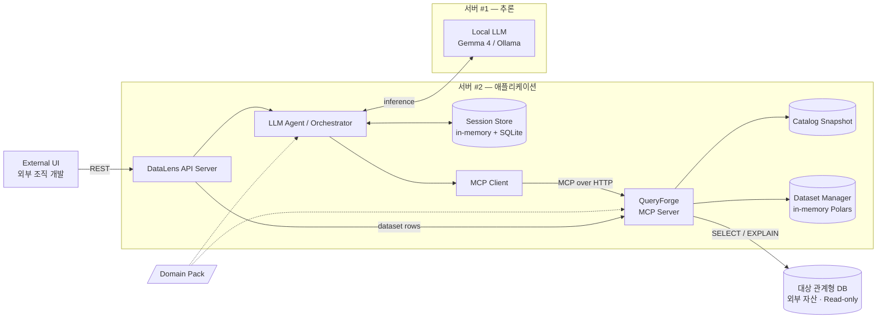

### 6.2 계층 구조

```
DataLens
├── API Layer          REST 계약, 인증, 요청 검증
├── Orchestration      Agent Loop, 스텝 제어, 오류 복구
├── Context Layer      세션 상태, 참조 해소, 컨텍스트 예산 관리
├── LLM Layer          LLMProvider 추상화, 프롬프트 조립, 구조화 디코딩
└── MCP Client         Tool 호출, 응답 파싱, 재시도

QueryForge (별도 문서)
└── MCP Interface → Tool Handler → Validation → Planning → Execution → Dataset Manager → DB Adapter / Polars
```

### 6.3 두 개의 데이터 경로

이 시스템에는 성격이 다른 두 경로가 있으며, 이를 혼동하면 컨텍스트가 폭증한다.

| 경로 | 내용 | 크기 |
|---|---|---|
| **판단 경로** | Agent ↔ LLM ↔ MCP Tool. 메타데이터·preview·요약만 오간다 | 수 KB |
| **표시 경로** | UI ↔ API ↔ QueryForge. Dataset 전체 행을 페이지 단위로 전달 | 수 MB |

**전체 데이터는 LLM을 절대 경유하지 않는다.** UI는 `dataset_id`로 직접 행을 받아 표를 그린다(FR-031).

---

## 7. Component별 책임

| ID | 컴포넌트 | 책임 | 하지 않는 것 |
|---|---|---|---|
| CMP-API | API Server | REST 계약, 인증, 세션 라우팅, Dataset 행 프록시 | 데이터 해석·판단 |
| CMP-AGENT | Agent / Orchestrator | 의도 판단, Tool 선택, 스텝 제어, 응답 생성 | 데이터 직접 계산 |
| CMP-CTX | Context Manager | 세션 상태, 참조 해소, 컨텍스트 예산 배분 | LLM 호출 |
| CMP-LLM | LLM Provider | 추론 호출, 구조화 출력 강제, 토큰 계수 | 도메인 지식 보유 |
| CMP-MCPC | MCP Client | Tool 호출, 응답 파싱, 오류 정규화 | 재해석·보정 |
| CMP-SEM | Semantic Provider | 용어→엔티티/지표 매핑 | 자연어 파싱 |
| CMP-PACK | Domain Pack Loader | 팩 로드·검증·스키마 호환성 확인 | 팩 내용 판단 |
| CMP-QF-* | QueryForge 내부 | QueryForge-DDD 참조 | 업무 의미 판단 |

---

## 8. Local LLM Agent 역할

### 8.1 책임 범위

Agent는 **"무엇을 해야 하는가"** 만 판단한다. 데이터 계산은 전량 QueryForge에 위임한다.

구체적으로 Agent가 하는 일:

1. 사용자 발화의 의도 분류 (신규 조회 / 기존 결과 변형 / 관계 확장 / 통계 요청 / 명확화 필요)
2. 지시 표현 해소 결과를 받아 대상 Dataset·엔티티 확정
3. Query/Transform Specification 생성
4. Tool 결과 확인 후 다음 행동 결정
5. 최종 응답 문장 생성

### 8.2 Agent Loop 제어

자유 ReAct 루프를 사용하지 않는다. **단계별로 허용 Tool이 제한된 상태 기계**로 구현한다.

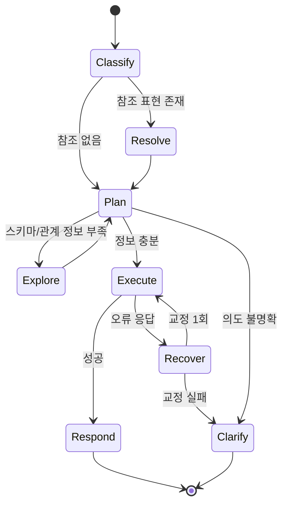

| 단계 | 허용 Tool | 비고 |
|---|---|---|
| Classify | 없음 | LLM 분류만 |
| Resolve | 없음 | 결정적 해소 + LLM 폴백 |
| Explore | `schema`, `relationship` | 최대 2회 |
| Execute | `query`, `transform`, `describe` | |
| Recover | Execute와 동일 | 1회 한정 |

**총 Tool 호출 스텝 상한 3회**(ADR-017). 근거는 스텝당 신뢰도가 곱으로 감쇠하기 때문이다.
스텝당 95%라도 8스텝이면 약 66%로 떨어진다. 스텝 수를 줄이는 것이 곧 정확도 설계다.

### 8.3 구조화 출력 강제

Specification 생성은 프롬프트로 형식을 부탁하지 않고 **JSON Schema 기반 constrained decoding**으로
강제한다(ADR-002). 소형 로컬 모델의 지배적 실패 모드인 형식 붕괴를 디코더 레벨에서 제거한다.

### 8.4 응답 생성 규칙

1. **수치는 Dataset 값만 인용한다.** LLM이 숫자를 생성하지 않는다.
2. 인용 가능한 값은 preview 5행과 summary에 한정된다. 그 외는 "표를 확인하세요"로 유도한다.
3. 업무적 판단(좋다/나쁘다)은 Domain Pack에 판단 기준이 선언된 경우에만 수행한다.
4. 불확실한 경우 단정하지 않고 근거를 함께 제시한다.

### 8.5 프롬프트 구성

```
prompts/<locale>/
├── system.md          역할, 금지사항, 출력 규칙
├── classify.md        의도 분류
├── resolve.md         참조 해소 폴백
├── plan_query.md      Query Spec 생성
├── plan_transform.md  Transform Spec 생성
├── recover.md         오류 교정
└── respond.md         최종 응답 생성
```

프롬프트는 코드에서 분리하며 로케일별로 관리한다(ADR-015).

---

## 9. MCP 역할

MCP는 **판단 엔진이 아니라 기능 제공 규약**이다.

| 항목 | 내용 |
|---|---|
| 역할 | Agent가 사용할 수 있는 데이터 기능을 표준 인터페이스로 노출 |
| Transport | Streamable HTTP (ADR-003) |
| Tool 개수 | 5개 고정 (ADR-017) |
| 인증 | 내부망 전용 + 공유 시크릿 헤더 (ADR-011) |

Tool 개수를 고정하는 이유는 로컬 모델의 Tool 선택 정확도가 Tool 개수에 민감하기 때문이다.
기능 추가는 새 Tool이 아니라 **기존 Tool의 operation 확장**으로 처리한다.

MCP를 HTTP로 둔 결과, QueryForge는 DataLens 없이도 다른 클라이언트가 사용할 수 있는
독립 제품이 된다. 이것이 재사용성 목표의 구조적 근거다.

---

## 10. QueryForge 역할

상세는 QueryForge-DDD를 참조한다. 시스템 관점의 책임만 기술한다.

| 책임 | 설명 |
|---|---|
| 안전한 실행 | 검증되지 않은 SQL을 실행하지 않는다. AST Validator 필수 통과 |
| Dataset 소유 | 조회·변환 결과의 단일 진실 원천 |
| 메타데이터 제공 | Catalog Snapshot 기반 스키마·관계 정보 |
| 계산 수행 | SQL 및 Polars 기반 집계·통계 |
| 자원 보호 | 타임아웃, 행 수 제한, 파티션 프루닝 강제 |

**QueryForge는 업무 의미를 판단하지 않는다.** "평균을 계산한다"는 QueryForge의 일이고,
"이 값이 나쁘다"는 Agent/Semantic Layer의 일이다.

---

## 11. API Server 역할

### 11.1 책임

1. REST 계약 제공 및 요청 검증
2. API Key 인증, 세션 격리
3. Agent 호출 및 타임아웃 관리
4. **Dataset 행 프록시** — UI 표 렌더링용 전체 데이터 전달 (LLM 미경유)
5. 오류 코드의 로케일 렌더링

### 11.2 엔드포인트 (초안)

| Method | Path | 설명 |
|---|---|---|
| POST | `/v1/sessions` | 세션 생성. `locale`은 서버 설정에서 결정 |
| GET | `/v1/sessions/{sid}` | 세션 상태 조회 (active_period, active_dataset 등) |
| DELETE | `/v1/sessions/{sid}` | 세션 종료 및 Dataset 해제 통지 |
| POST | `/v1/sessions/{sid}/messages` | 대화 메시지 처리 (핵심) |
| GET | `/v1/sessions/{sid}/datasets` | 세션이 보유한 Dataset 목록 |
| GET | `/v1/sessions/{sid}/datasets/{dsid}` | Dataset 메타 + 스키마 |
| GET | `/v1/sessions/{sid}/datasets/{dsid}/rows` | 행 데이터 페이지 조회 (`offset`, `limit`) |
| GET | `/v1/health` | LLM / QueryForge / DB 개별 상태 |
| GET | `/v1/catalog/fingerprint` | 현재 카탈로그 지문 (변경 감지용) |

### 11.3 메시지 응답 구조 (개념)

```json
{
  "session_id": "sess_...",
  "answer": "어제 기준 상위 10건입니다. ...",
  "datasets": [
    { "dataset_id": "ds_000004", "row_count": 10, "columns": [...], "role": "primary" }
  ],
  "active_period": { "from": "2026-08-09", "to": "2026-08-09", "timezone": "Asia/Seoul" },
  "steps": [
    { "tool": "query", "duration_ms": 1830 },
    { "tool": "transform", "duration_ms": 45 }
  ],
  "warnings": [],
  "error": null
}
```

`answer`는 사람이 읽는 문장, `datasets`는 UI가 표를 그리기 위한 참조다.
UI는 `role: primary`인 Dataset을 기본 표로 렌더링하고 행은 별도 호출로 가져온다.

### 11.4 인증

PoC는 정적 API Key 헤더 인증이며, 사용자별 DB 권한 매핑은 범위 외다(ADR-011).
세션 간 `dataset_id` 교차 접근은 거부한다.

---

## 12. Conversation State 설계 개념

### 12.1 원칙

대화 연속성을 **LLM 채팅 이력에 의존하지 않는다.** 명시적 상태 객체로 관리한다.
이유는 두 가지다. 컨텍스트 예산이 하드 제약이라 원문 누적이 불가능하고(ADR-017),
지시 표현 해소는 확률적 추론보다 결정적 조회가 정확하기 때문이다.

### 12.2 상태 모델

```
Session
├── session_id
├── locale               ko | ja (서버 설정에서 파생)
├── timezone
├── created_at / last_active_at
├── active_period        { from, to }        ← "어제", "최근 7일"
├── active_dataset_id    ds_000004           ← "그중", "이것들"
├── active_entities      [{ label, column, value, dataset_id }]  ← "C만", "아까 A"
├── dataset_refs         [DatasetRef]        최근 N개 (기본 20)
├── session_aliases      { "A": "ABC-XXX" }  ← 사용자 정의 (UC-008)
├── history              [TurnSummary]       구조화 요약
└── last_error           오류 복구용
```

```
TurnSummary
├── turn_no
├── user_utterance       원문 (짧게 유지)
├── intent               분류 결과
├── tools_used           [{ tool, spec_digest }]
├── result_dataset_id
└── result_digest        "10행 × 5열, 상위 항목 XXX"
```

```
DatasetRef                (DataLens는 메타만 보유. 실데이터는 QueryForge)
├── dataset_id
├── parent_dataset_id
├── operation            생성 방식 요약
├── row_count / columns
├── entity_labels        [{ index, label }]  ← "첫 번째" 해소용
└── created_at
```

### 12.3 컨텍스트 조립

매 턴 LLM에 넣는 컨텍스트는 예산표(ADR-017)에 따라 조립한다.

| 구성 | 출처 | 상한 |
|---|---|---|
| 시스템 프롬프트 + Tool 정의 | `prompts/<locale>/` | 2,000 토큰 |
| 스키마 컨텍스트 | 이번 턴에 필요한 테이블만 | 2,500 |
| 대화 이력 | `history` 최근 N턴 요약 | 2,000 |
| Dataset 메타 + preview | `active_dataset` 중심 | 1,500 |
| Semantic 컨텍스트 | 해소된 alias·지표 정의만 | 1,000 |

**초과 시 오래된 TurnSummary부터 축약**하며, 축약해도 초과하면 사용자에게 새 세션을 권고한다.

### 12.4 세션 저장

in-memory 기본, SQLite 영속화 선택(ADR-008). 세션 TTL 초과 시 QueryForge에 Dataset 해제를 통지한다.

---

## 13. Dataset State / Lineage 설계 개념

### 13.1 소유권

| 항목 | 소유자 |
|---|---|
| Dataset 실데이터 | QueryForge (단일 진실 원천) |
| Dataset 메타·lineage 사본 | DataLens (참조·해소용) |
| Dataset TTL·축출 | QueryForge |
| 세션 수명 | DataLens |

DataLens는 행 데이터를 절대 보관하지 않는다. 통지가 유실되어도 QueryForge TTL로 회수된다(ADR-006).

### 13.2 Lineage

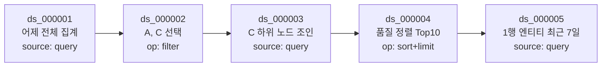

lineage가 필요한 이유는 세 가지다.

1. **참조 해소** — "그중"이 어느 Dataset인지 확정
2. **기간 재조회** — "기간만 최근 7일로"에서 조건을 재사용하고 기간만 교체
3. **설명 가능성** — 결과가 어떤 경로로 나왔는지 사용자에게 제시

### 13.3 참조 해소 전략

**결정적 해소를 우선하고 LLM은 폴백으로만 사용한다.**

| 표현 유형 | 해소 방법 |
|---|---|
| "그중", "이것들", "얘만" | `active_dataset_id` 직접 참조 |
| "첫 번째", "두 번째", "마지막" | `entity_labels`의 인덱스 조회 |
| "아까 C", "A랑 C" | `active_entities` + `session_aliases` 매칭 |
| "어제 말고 최근 일주일" | `active_period` 치환 |
| 그 외 모호 표현 | LLM 해소 → 확신 낮으면 되묻기 |

이 전략이 성립하려면 **QueryForge 응답에 안정적인 행 인덱스와 엔티티 라벨이 포함**되어야 한다.
이는 MCP Response 설계 요구사항으로 QueryForge-DDD에 반영한다.

---

## 14. Semantic Layer 개념

### 14.1 정의

Semantic Layer는 **자연어를 JSON으로 바꾸는 계층이 아니다.** 업무 개념과 DB 구조를 연결하는
지식 계층이다. 자연어 해석은 Agent의 일이다.

```
업무 개념                 Semantic Layer            DB 구조
"기지국"        ────────→ entity mapping   ────→  cell_master 테이블
"성공률"        ────────→ metric formula   ────→  ok_cnt / total_cnt
"A"             ────────→ alias            ────→  ABC-XXX
"게이트웨이→기지국" ────→ relationship     ────→  JOIN 조건
```

### 14.2 Domain Pack (ADR-009)

도메인 지식은 코드가 아니라 **버전 관리되는 배포 아티팩트**다.

```
packs/<pack_name>/
├── pack.yaml            이름, 버전, 대상 스키마 fingerprint, 호환 범위
├── semantic.yaml        alias, entity mapping, metric/KPI 정의
├── relationships.yaml   FK 부재 시 관계 보강 선언
├── partitions.yaml      파티션 키, 기본 기간, 최대 조회 범위, day_boundary
├── locale/{ko,ja}.yaml  로케일별 표기
└── examples.jsonl       few-shot 예시
```

이 구조가 **"Core는 범용" 과 "실제로 정확히 동작"** 이라는 모순된 두 요구를 동시에 만족시키는
유일한 방법이다. 다음 고객사에는 Domain Pack만 새로 작성한다(FR-043).

### 14.3 인터페이스

```
SemanticProvider
├── resolve_term(term, locale)        → CanonicalTerm | None
├── find_entity(term)                 → EntityMapping[]
├── find_metric(term)                 → MetricDefinition[]
└── find_relationship(from, to)       → RelationshipDef[]
```

PoC 구현체는 `DictionarySemanticProvider`(Domain Pack YAML 기반) 하나다(ADR-010).

### 14.4 세션 학습

UC-008의 "A는 ABC-XXX를 말하는 거야"는 `session_aliases`에 즉시 반영되고 세션 종료 시 소멸한다.
영속화 및 팩 반영은 확장 범위이며, 그때도 **자동 반영이 아니라 후보 제안 → 사람 승인** 방식을 취한다.

---

## 15. 향후 RAG / Vector DB 확장 구조

### 15.1 방향

모델 파인튜닝이 아니라 **외부 지식 축적**을 전략으로 삼는다. 폐쇄망에서 재학습 파이프라인을
운영하는 비용이 비현실적이고, 지식 갱신 주기가 모델 갱신 주기보다 훨씬 짧기 때문이다.

### 15.2 확장 형태

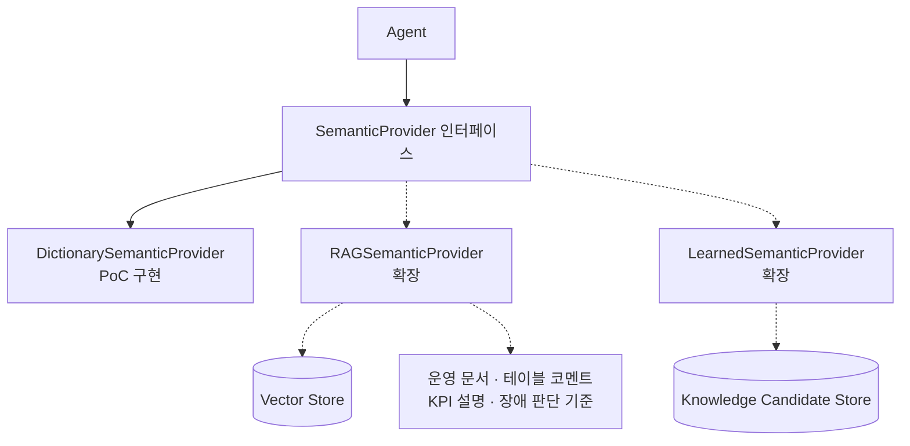

| 저장소 | 용도 |
|---|---|
| Structured Semantic Store | 정확한 매핑 (alias → 정식 엔티티, 지표 수식) |
| Vector Store | 비정형 의미 정보 (운영 매뉴얼, KPI 설명, 판단 기준) |
| Candidate Store | 대화에서 추출된 학습 후보. 사람 승인 후 팩에 반영 |

### 15.3 PoC에서 확보하는 것

인터페이스 시그니처 고정만 한다. 구현체는 추가하지 않는다(ADR-010).
임베딩 모델 구동은 서버 #2의 잔여 GPU를 예약한다.

---

## 16. Query 처리 Flow

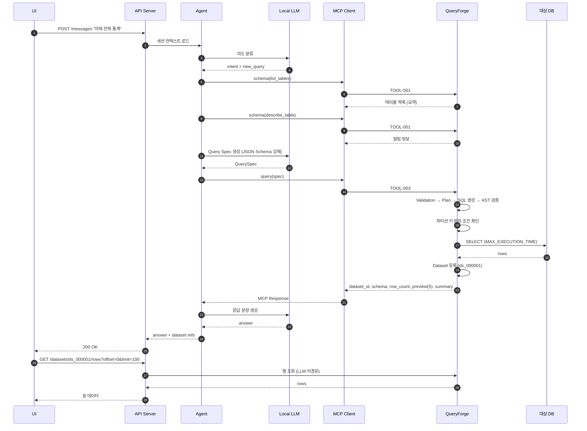

### 16.1 파티션 프루닝 강제 (ADR-016)

시간 범위 조건이 없으면 **실행 전에 거부**한다.

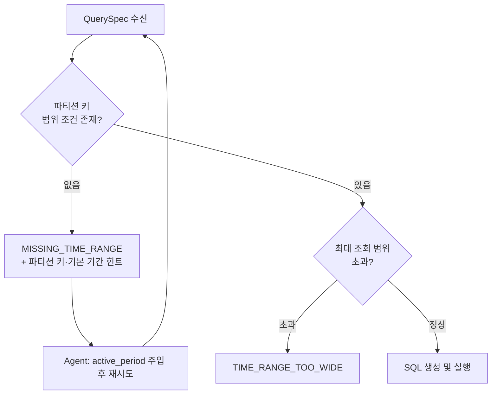

Agent는 `active_period`를 항상 유지하므로 대부분의 경우 재시도 없이 통과한다.
거부는 안전망이며, 정상 경로에서 반복 발생하면 Domain Pack 선언이 잘못된 것이다.

---

## 17. 연속 대화 처리 Flow

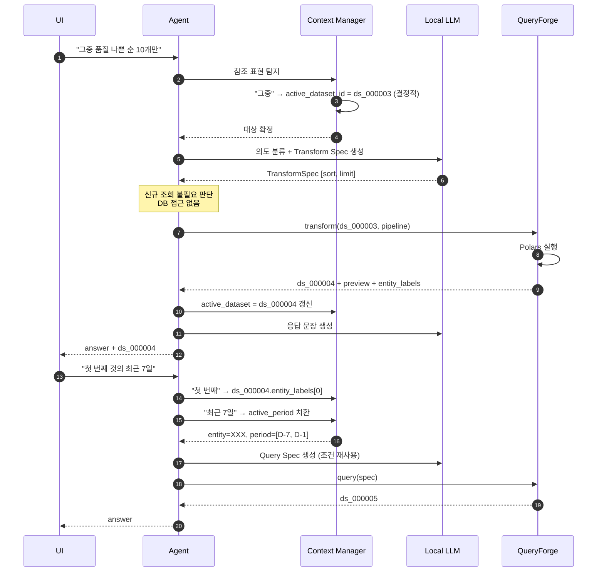

### 17.1 핵심 포인트

1. **"그중" 처리에 DB 접근이 없다.** 기존 Dataset을 Polars로 변환할 뿐이다. 응답이 빠르고 DB 부하가 없다.
2. **참조 해소는 LLM 이전에 수행한다.** 결정적으로 확정 가능한 것을 확률 추론에 맡기지 않는다.
3. **entity_labels가 없으면 "첫 번째"가 불가능하다.** MCP Response 설계의 필수 요구사항이다.

### 17.2 오류 복구 루프

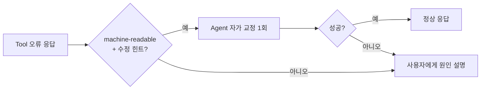

오류 응답에는 교정 가능한 힌트를 포함한다. 예: `UNKNOWN_COLUMN` 시
`did_you_mean: ["success_rate", "attach_success_rate"]`. 이 힌트 유무가 소형 모델의
회복률을 크게 좌우한다.

---

## 18. DB 변경 대응 구조

### 18.1 원칙

대상 DB는 **외부 자산**이다. 본 시스템은 변경을 통제할 수 없고 통보받지 못할 수도 있다.
따라서 변경을 **탐지**하고 **영향 범위를 알리는** 구조를 갖춘다.

### 18.2 Catalog Snapshot

`information_schema`의 `TABLES` / `COLUMNS` / `STATISTICS` / `KEY_COLUMN_USAGE` / `PARTITIONS`를
사전 수집해 로컬 카탈로그로 보관한다. 매 호출마다 DB를 조회하지 않는다(ADR-016).

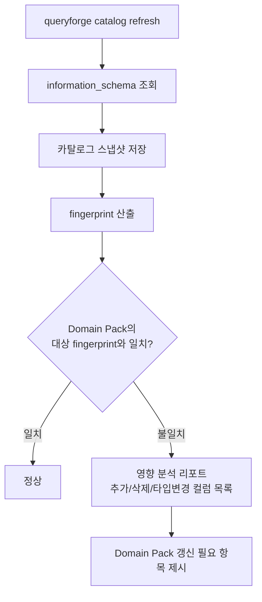

### 18.3 운영 절차

| 상황 | 대응 |
|---|---|
| 컬럼 추가 | 카탈로그 갱신만. 기존 동작 영향 없음 |
| 컬럼 삭제·개명 | Domain Pack의 alias·지표 정의 갱신 필요. 리포트로 대상 제시 |
| 테이블 추가 | 카탈로그 갱신. 필요 시 팩에 alias 추가 |
| 파티션 정책 변경 | `partitions.yaml` 갱신 필수. 미갱신 시 프루닝 검증 실패로 조회 거부 |
| 타입 변경 | 리포트로 제시. 지표 수식 검토 |

갱신은 **명시적 CLI 명령으로만** 수행한다. 자동 갱신은 운영 중 예기치 않은 동작 변화를 만든다.

---

## 19. 폐쇄망 운영 고려사항

| 항목 | 방침 |
|---|---|
| 외부 API 의존 | 없음. LLM·DB·MCP 전부 내부 |
| 패키지 설치 | 런타임에 PyPI 접근 금지. 이미지에 사전 포함 |
| 배포 형태 | docker-compose (`api`, `queryforge`, `llm`) (ADR-014) |
| 반입물 | 이미지 tar, 모델 가중치, Domain Pack, compose 파일, 설치 절차서 |
| 모니터링 | 외부 SaaS 미사용. 구조화 로그 파일 + 헬스체크 |
| 시각 동기 | NTP 불가 가능성. 타임존은 설정값으로 고정하고 서버 시각 확인 절차 포함 |
| 업데이트 | 이미지 교체 방식. 인플레이스 패치 금지 |

### 19.1 설치 검증 체크리스트

1. GPU 인식 및 VRAM 확인 (`nvidia-smi`)
2. 모델 로드 및 오프로드 미발생 확인
3. DB 읽기 전용 계정 접속 확인
4. `catalog refresh` 성공 및 fingerprint 기록
5. Domain Pack 로드 및 스키마 호환성 검증
6. golden set 스모크 5문항 통과
7. 로케일 설정 확인 (언어·타임존)

---

## 20. 보안 고려사항

| 영역 | 방침 | 참조 |
|---|---|---|
| DB 계정 | 읽기 전용 계정. 쓰기 권한 계정 사용 금지 | ADR-016 |
| Credential | 평문 저장 금지. compose secrets / 환경변수 주입 | ADR-013 |
| SQL 안전성 | AST Validator 필수 통과. 정규식 검사 금지 | ADR-002 |
| 세션 격리 | 타 세션 `dataset_id` 접근 거부 | ADR-011 |
| API 인증 | API Key 헤더. QueryForge는 내부망 전용 | ADR-011 |
| 로그 마스킹 | 접속 문자열·행 데이터 미기록. 스키마·건수만 | NFR-011 |
| 프롬프트 주입 | DB 데이터가 Agent 지시로 해석되지 않도록 데이터 영역 분리 | 본절 20.1 |
| 감사 | 모든 실행 SQL과 Tool Call을 구조화 로그로 기록 | |

### 20.1 프롬프트 주입 방어

DB에 저장된 문자열이 LLM 프롬프트에 들어간다. 해당 값이 지시문으로 해석되지 않도록:

1. Dataset preview는 **데이터 블록으로 명확히 구분**하여 주입한다.
2. Specification 생성은 constrained decoding으로 형식이 고정되므로, 자유 텍스트 지시가
   실행 경로로 전환되지 않는다.
3. 최종 실행 SQL은 Validator를 통과하므로 데이터 유래 문자열이 구문으로 승격될 수 없다.

이 세 겹이 구조적 방어선이다.

---

## 21. 장애 / 실패 처리 원칙

### 21.1 기본 원칙

| 원칙 | 내용 |
|---|---|
| Fail-closed | 검증 불가·파싱 불가는 실행하지 않고 거부한다 |
| Machine-readable | 오류는 코드 + 구조화 상세로 반환. Agent가 교정 가능해야 한다 |
| 추측 금지 | 정보 부족 시 임의 실행 대신 되묻는다 |
| 수치 생성 금지 | 조회 실패 시 LLM이 값을 만들어내지 않는다 |
| 부분 실패 명시 | 일부만 성공했으면 성공 범위를 명확히 밝힌다 |

### 21.2 장애 유형별 대응

| 유형 | 사용자 응답 | 시스템 동작 |
|---|---|---|
| LLM 미응답 / 타임아웃 | "처리 시간이 초과되었습니다" | 세션 유지, 재시도 안내 |
| Tool call 형식 오류 | (내부 처리) | 1회 재생성. 실패 시 명확화 질문 |
| 스키마 불일치 | 대상 후보 제시 | `did_you_mean` 힌트 활용 |
| 시간 범위 누락 | 기간 확인 질문 | `active_period` 주입 후 재시도 |
| 쿼리 타임아웃 | 범위 축소 제안 | DB 세션 정리 |
| 결과 과대 | 상위 N건 제안 | `RESULT_TOO_LARGE` |
| Dataset 만료 | 재조회 안내 | lineage로 재생성 가능 여부 제시 |
| DB 연결 실패 | "데이터 연결에 문제가 있습니다" | 헬스체크 반영, 상세는 로그에만 |
| 컨텍스트 초과 | 새 세션 권고 | 오래된 이력부터 축약 시도 후 |

### 21.3 관측

폐쇄망이므로 구조화 로그 파일 + 헬스체크가 관측 수단의 전부다. 최소 기록 항목:

- Tool Call 로그 (tool, 소요, 결과 크기, 오류 코드)
- 실행 SQL (파라미터 마스킹) 및 소요, 스캔/반환 행 수
- LLM 호출 (prefill/decode 토큰 수, 소요)
- Agent 스텝 수 및 종료 사유
- Dataset 생성·축출 이벤트, 메모리 사용량

---

## 22. 확장성 및 재사용성

### 22.1 교체 축

| 축 | 교체 대상 | 인터페이스 |
|---|---|---|
| 모델 | Gemma 4 → 타 모델 | `LLMProvider` |
| DBMS | MySQL → PostgreSQL 등 | `DatabaseAdapter` |
| 도메인 | 통신 → 타 도메인 | Domain Pack |
| 의미 지식 | 사전 → RAG | `SemanticProvider` |
| Dataset 저장 | in-memory → spill | `DatasetStore` |
| 세션 저장 | in-memory → SQLite/외부 | `SessionStore` |
| 로케일 | ko → ja → 기타 | `locales/<CC>.yaml` |

**PoC에서 구현체는 각 축마다 하나씩만 만든다.** 인터페이스는 완비하고 구현은 순차 확장한다(ADR-018).

### 22.2 재사용성 보장 장치

1. **리포지토리 물리 분리** — QueryForge는 독립 semver·독립 CI (ADR-019)
2. **도메인 용어 CI 검사** — QueryForge 리포에서 도메인 용어 검출 시 빌드 실패 (ADR-009)
3. **wheel 의존** — DataLens가 QueryForge를 버전 핀으로 의존

1인 개발 체제에는 리뷰어가 없다. 자동 검사가 유일한 방어선이다.

---

## 23. PoC 범위

### 23.1 포함

| 영역 | 포함 내용 |
|---|---|
| Tool | 5종 전부 (schema, relationship, query, transform, describe) |
| Query | projection, filter(AND/OR 1단계), 비교/IN/NULL/범위, join(relationship 참조), group by, aggregation, order by, limit |
| Transform | select, rename, filter, sort, limit, group_by, aggregate, derive, rank, distinct, null 처리, type cast, compare |
| 통계 | count, sum, mean, median, min, max, stddev, variance, quantile, unique count, rate, delta, pct change, rank |
| 대화 | 5턴 연속 시나리오, 지시 표현 해소, 기간 변경 |
| Semantic | Domain Pack 기반 alias·엔티티·지표·관계 |
| 로케일 | KR / JP 전환 |
| 운영 | docker-compose 배포, 오프라인 번들, 구조화 로그 |
| 검증 | golden set 및 자동 평가 |

### 23.2 인터페이스만 확보 (미구현)

| 항목 | 상태 |
|---|---|
| `query_sql` (Text-to-SQL) | tool 정의·flag·Validator 경로만. 본체 미구현 (ADR-002) |
| MySQL 외 DBMS | Adapter 인터페이스만 |
| RAG / Vector Store | Provider 인터페이스만 (ADR-010) |
| Dataset spill | `DatasetStore` 인터페이스만 (ADR-006) |
| SSE 스트리밍 / job polling | API 예약 필드만 (ADR-012) |
| 사용자별 권한 매핑 | 미착수 (ADR-011) |

### 23.3 마일스톤

| ID | 기간 | 산출물 | Exit Criteria |
|---|---|---|---|
| S0 | 2주 | 문서 3종, Tool Schema 동결, LLM 스파이크 | ADR-001 실측 확정, tool call 유효율 측정치 |
| S1 | 4주 | 최소 수직 슬라이스 | 단일턴 golden 20문항 통과율 보고 |
| S2 | 4주 | join·집계, 멀티턴, lineage | UC-002~004 시나리오 동작 |
| S3 | 3주 | Semantic 최소본, 오류 복구, 파티션 최적화 | 대표 시나리오 5턴 완주 |
| S4 | 2주 | 로케일 전환, 리소스 제한, 설치 리허설 | 폐쇄망 설치 리허설 성공 |

### 23.4 PoC 성공 판정 기준

1. 대표 시나리오(3.1) 5턴 완주
2. golden set 단일턴 정답률 80% 이상 (NFR-007)
3. 멀티턴 5턴 완주율 60% 이상 (NFR-008)
4. 파티션 프루닝 미적용 쿼리 0건 (NFR-010)
5. 로케일 전환이 설정 변경만으로 동작 (NFR-013)
6. QueryForge 리포에 도메인 용어 0건 (ADR-009)

---

## 24. PoC 이후 확장 범위

| 우선순위 | 항목 | 비고 |
|---|---|---|
| 1 | 응답 스트리밍 (SSE) | 체감 지연 개선. S0 실측 기반 판단 |
| 2 | Text-to-SQL 활성화 | Validator·flag는 이미 존재 |
| 3 | RAG Semantic Provider | 운영 문서·컬럼 코멘트 활용 |
| 4 | 학습 후보 축적 및 승인 워크플로 | 사람 승인 전제 |
| 5 | 다중 DBMS Adapter | PostgreSQL 우선 |
| 6 | 사용자별 접근 제어 | 고객사 요구 확인 후 (ADR-011) |
| 7 | Dataset spill / 멀티 워커 | 동시성 요구 발생 시 (ADR-004, 006) |
| 8 | 차트·시각화 스펙 반환 | UI 협의 필요 |
| 9 | 정기 리포트 / 알림 | |

---

## 25. 주요 기술 선택과 선택 이유

| 선택 | 대안 | 선택 이유 | ADR |
|---|---|---|---|
| Gemma 4 계열 | Qwen3, Llama | Apache 2.0로 납품 법무 리스크 없음, native function calling, 다국어 | ADR-001 |
| 12B 기본 / 26B 대안 | 26B 고정 | A2 15.3GB에서 26B Q4는 KV 캐시 여유 부족. 실측으로 확정 | ADR-001 |
| Streamable HTTP | stdio | 독립 서버·독립 재기동·Dataset 상주 구조와 정합 | ADR-003 |
| 구조화 Spec | Text-to-SQL 우선 | 검증 가능성, 소형 모델의 형식 붕괴 회피 | ADR-002 |
| Constrained decoding | 프롬프트 지시 | 형식 오류를 디코더 레벨에서 구조적으로 제거 | ADR-002 |
| Polars | pandas | 표현식 기반 안전 변환, 성능, LazyFrame 최적화 | QueryForge-DDD |
| sqlglot | 정규식 검사 | AST 기반 금지 구문 탐지, 순수 Python(폐쇄망 적합) | ADR-007 |
| in-memory Dataset | Parquet spill | RAM 128GB, 세션 수 적음. 구현·검증 비용 대비 이득 없음 | ADR-006 |
| 단일 워커 | 멀티 워커 | in-process Dataset 정합성. 조기 분산화는 검증 부담만 증가 | ADR-004 |
| Domain Pack | Core 설정 분기 | 범용성과 정확도를 동시에 만족하는 유일한 구조 | ADR-009 |
| 국가 코드 단일 env | 개별 언어/TZ 설정 | 설정 누락으로 인한 불일치 원천 차단 | ADR-015 |
| docker-compose | k8s | 폐쇄망 단일 서버 규모에 적합, 반입·설치 단순 | ADR-014 |

---

## 26. 전체 Sequence Diagram

### 26.1 신규 조회 (Cold Start)

16장 참조.

### 26.2 후속 질의 (Warm)

17장 참조.

### 26.3 세션 종료 및 자원 회수

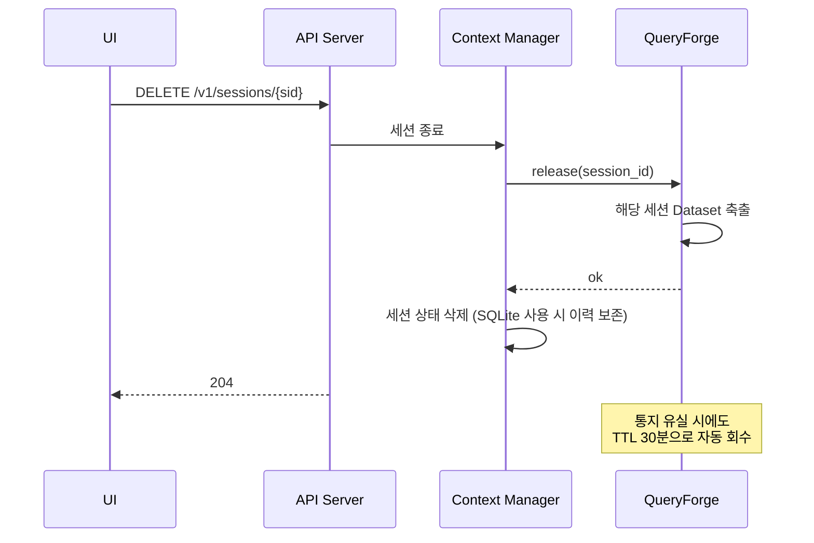

---

## 27. Component Diagram

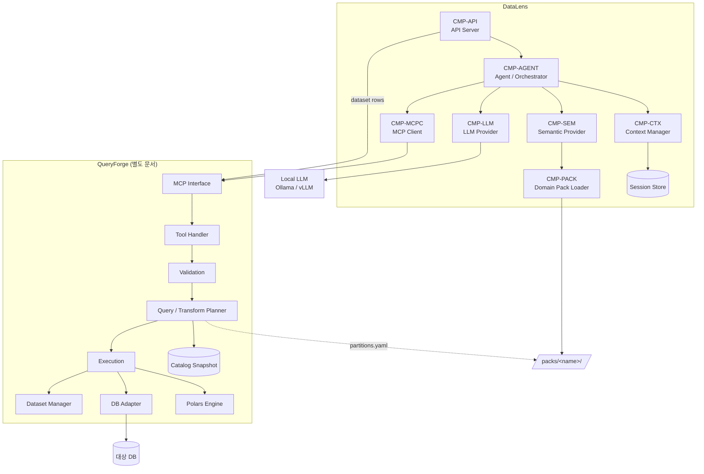

---

## 28. 주요 설계 원칙 및 금지사항

### 28.1 설계 원칙

| # | 원칙 |
|---|---|
| P-1 | Core는 도메인을 모른다. 도메인 지식은 Domain Pack에만 존재한다 |
| P-2 | Agent는 판단하고 QueryForge는 실행한다. 이 경계를 흐리지 않는다 |
| P-3 | 전체 데이터는 LLM 컨텍스트를 경유하지 않는다. ID로 참조한다 |
| P-4 | 결정적으로 확정 가능한 것을 LLM에 맡기지 않는다 |
| P-5 | 스텝 수를 줄이는 설계가 정확도 설계다 |
| P-6 | 검증 불가능한 것은 실행하지 않는다 (fail-closed) |
| P-7 | 모든 기능은 인수 기준·테스트와 한 쌍으로 정의한다 |
| P-8 | 대상 DB는 외부 자산이다. 읽기만 한다 |
| P-9 | 인터페이스는 완비하고 구현은 순차 확장한다 |
| P-10 | 미확정 사항은 본문에 방치하지 않고 ADR로 관리한다 |

### 28.2 금지사항

| # | 금지 | 사유 |
|---|---|---|
| N-1 | Core 코드에 도메인 개념(PGW/HSS/CELL/기지국 등) 등장 | 재사용성 파괴. CI로 강제 차단 |
| N-2 | LLM이 생성한 임의 Python/Polars 코드 실행 | 안전성 |
| N-3 | 정규식만으로 SQL 검사 | 우회 가능. AST 필수 |
| N-4 | 전체 스키마를 한 번에 LLM에 주입 | 컨텍스트 폭증 |
| N-5 | Dataset 전체 행을 MCP Response에 포함 | 컨텍스트 폭증. preview 5행 고정 |
| N-6 | 대화 원문 무제한 누적 | 컨텍스트 예산 초과 |
| N-7 | 대상 DB에 DDL·인덱스·파티션·통계 조작 | 외부 자산 |
| N-8 | 시간 범위 조건 없는 대용량 테이블 조회 | 운영 DB 부하 |
| N-9 | Credential 평문 저장 | 보안 |
| N-10 | 응답 언어를 사용자 발화로부터 추론 | 로케일 정책 위반 |
| N-11 | LLM이 수치를 생성 | 신뢰성. Dataset 값만 인용 |
| N-12 | Tool 개수 임의 증설 | 로컬 모델 선택 정확도 저하 |
| N-13 | 멀티 워커 기동 | in-process Dataset 정합성 파괴 |
| N-14 | 카탈로그 자동 갱신 | 운영 중 예기치 않은 동작 변화 |

---

## 부록 A. 미해결 액션 아이템

ADR의 액션 아이템 요약표를 참조한다. S1 착수 전 확인 필요 항목:

1. MySQL 버전 (8.0 이상 여부) — SQL Generator 분기 결정
2. FK 제약 설정 여부 — `relationships.yaml` 필수 여부
3. 일자 경계 / 적재 타임존 — "어제" 해석의 정확성
4. 읽기 전용 계정 발급 가능 여부

---

## 개정 이력

| 버전 | 일자 | 내용 |
|---|---|---|
| 0.1 | 2026-08-10 | 초안. FR/NFR/UC 등록, 아키텍처 및 플로우 확정 |